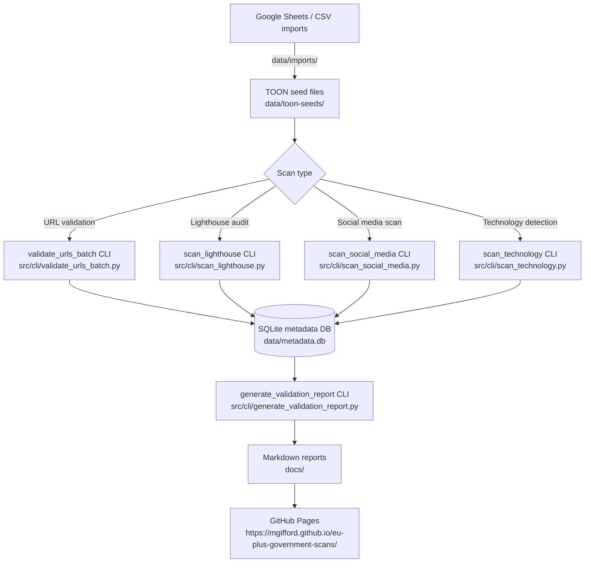

# eu-plus-government-scans

[](LICENSE)
[](https://github.com/mgifford/eu-plus-government-scans/actions/workflows/deploy-pages.yml)
[](https://mgifford.github.io/eu-plus-government-scans/)

Scans and seed datasets for finding accessibility statements on government websites,
with a Europe-first scope (plus selected non-EU countries like UK and Switzerland).

## Table of contents

- [Who this is for](#who-this-is-for)
- [How it works](#how-it-works)
- [What is in this repository](#what-is-in-this-repository)
- [Data imports](#data-imports)
- [TOON seed outputs](#toon-seed-outputs)
- [WP01 foundation implementation](#wp01-foundation-implementation)
- [URL validation scanner](#url-validation-scanner)
- [Google Lighthouse scanning](#google-lighthouse-scanning)
- [Running tests locally](#running-tests-locally)
- [Data caching and storage](#data-caching-and-storage)
- [AI disclosure](#ai-disclosure)
- [Next steps](#next-steps)

## Who this is for

This repository is intended for **developers and researchers** who want to:

- Fork or clone the project and run their own accessibility-statement discovery scans.
- Contribute new country seed data (TOON files) or improve scanning logic.
- Understand the automated batch-validation pipeline and extend it.

If you are looking for the published scan results and reports, see the
[GitHub Pages site](https://mgifford.github.io/eu-plus-government-scans/).

## How it works



All scanning runs automatically via **GitHub Actions** (cron schedules + manual triggers).
Results are stored as **workflow artifacts** and published to GitHub Pages — nothing is
committed back to the repository except the original seed TOON files.

## What is in this repository

- Planning and implementation artifacts for feature `001-eu-government-accessibility-statement-discovery`
- Imported government domain/page source lists from Google Sheets
- Country-split TOON seed files that include domains and page URLs

## Data imports

Imported CSV source sheets are stored under:

- `data/imports/google_sheets/`
- `data/imports/government_domains_pages_gid_242285945.csv` (Canada list)

Useful generated summaries:

- `data/imports/google_sheets/manifest.csv`
- `data/imports/google_sheets/summary.json`
- `data/imports/google_sheets/coverage_check.json`
- `data/imports/google_sheets/all_sheets_merged.csv`

## TOON seed outputs

All-country seed files:

- `data/toon-seeds/countries/*.toon`
- `data/toon-seeds/index.json`

Review bundles:

- EU-only bundle: `data/toon-seeds/eu-only/countries/*.toon`
- EU-only index: `data/toon-seeds/eu-only/index.json`
- UK + Switzerland bundle: `data/toon-seeds/uk-ch/countries/*.toon`
- UK + Switzerland index: `data/toon-seeds/uk-ch/index.json`

Each `.toon` seed currently contains, per country:

- `domains[]` keyed by canonical domain
- `pages[]` including URL and root-page flag (plus score fields when present)
- `source_tabs[]` provenance references (`sheet_id`, `gid`, source URL)

## WP01 foundation implementation

Initial backend foundation for the feature is included (WP01):

- `src/lib/settings.py` runtime settings and validation
- `src/services/source_ingest.py` source ingestion adapters
- `src/services/domain_normalizer.py` hostname normalization helpers
- `src/storage/schema.py` metadata schema bootstrap + migration seed
- Unit/integration tests under `tests/`

## URL validation scanner

A URL validation scanner is available to validate government site accessibility from TOON files:

- `src/services/url_validator.py` - Async URL validation with redirect tracking
- `src/jobs/url_validation_scanner.py` - Batch scanner for TOON files
- `src/cli/validate_urls.py` - CLI interface for running scans (legacy)
- `src/cli/validate_urls_batch.py` - **New batched CLI for large-scale validation**
- `src/cli/generate_validation_report.py` - Generate validation reports from database

Key features:
- Validates URLs and tracks HTTP status codes and errors
- Records and follows redirects, updating URLs for future scans
- Tracks failure counts: first failure is noted, second failure removes URL
- No retry within same scan session
- **Batched processing** - Handle 80k+ URLs without timeout
- **GitHub Issue tracking** - Monitor progress across multiple runs
- **Automated cron scheduling** - Run every 2 hours automatically
- **Issue-triggered validation** - Trigger scans by creating GitHub issues

### Issue-triggered validation (NEW!)

Trigger validation scans by simply creating a GitHub issue with a special title prefix:

- **`SCAN: <description>`** - Run once and close issue when complete
- **`QUARTERLY:`, `MONTHLY:`, `WEEKLY:`, etc.** - Run periodically, keep issue open

When triggered, the system:
1. Validates all URLs across all countries
2. Posts a detailed report as a comment to the issue
3. Closes the issue (for one-time scans) or keeps it open (for periodic scans)

See **[docs/issue-triggered-validation.md](docs/issue-triggered-validation.md)** for complete documentation.

**Example:**
1. Create issue titled `SCAN: Validate URL`
2. Wait for hourly check (runs every hour)
3. Review report posted as comment
4. Issue automatically closes when complete

**Workflows:**
- `.github/workflows/issue-triggered-validation.yml` - Checks for trigger issues every hour

### Batched validation (recommended)

For large-scale validation (all countries), use the **batched system** which:
- Processes countries in small batches (default: 5 at a time)
- Runs automatically every 2 hours via GitHub Actions cron
- Tracks progress in a GitHub Issue
- Never times out (spreads work over multiple days)
- Fully resumable if interrupted

See **[docs/batched-validation.md](docs/batched-validation.md)** for complete documentation.

Quick start:
```bash
# Process next batch of countries (creates GitHub issue)
python3 -m src.cli.validate_urls_batch --batch-mode --create-issue

# Process specific batch size
python3 -m src.cli.validate_urls_batch --batch-mode --batch-size 10
```

**Workflows:**
- `.github/workflows/validate-urls-batch.yml` - Runs every 2 hours (automatic)
- `.github/workflows/reopen-validation-cycle.yml` - Starts new cycles quarterly

### Single country / legacy validation

For validating individual countries or small sets:

**GitHub Action (UI-based):**

The easiest way to run single-country validations:

1. Go to the **Actions** tab in this repository
2. Select **"Validate Government URLs"**
3. Click **"Run workflow"** and optionally specify a country
4. View results in the workflow summary and download detailed reports

See [docs/github-action-validation.md](docs/github-action-validation.md) for full instructions.

**CLI Usage:**

For local or manual validation:

```bash
# Install dependencies
pip install -r requirements.txt

# Validate a specific country
python3 -m src.cli.validate_urls --country ICELAND --rate-limit 2

# Validate all countries (may timeout - use batch mode instead)
python3 -m src.cli.validate_urls --all --rate-limit 2

# Generate a report from validation results
python3 -m src.cli.generate_validation_report --output validation-report.md
```

See [docs/url-validation-scanner.md](docs/url-validation-scanner.md) for detailed CLI usage.

## Google Lighthouse scanning

The Lighthouse scanner runs Google Lighthouse audits on government page URLs and stores five
headline scores: **performance**, **accessibility**, **best practices**, **SEO**, and **PWA**.

- `src/services/lighthouse_scanner.py` — Async Lighthouse runner (subprocess-based)
- `src/jobs/lighthouse_scanner.py` — Job that processes TOON files and persists results
- `src/cli/scan_lighthouse.py` — CLI entry point

```bash
# Prerequisites: install the Lighthouse CLI
npm install -g lighthouse

# Scan a specific country
python3 -m src.cli.scan_lighthouse --country ICELAND

# Scan all countries with a runtime cap
python3 -m src.cli.scan_lighthouse --all --max-runtime 110 --rate-limit 0.2
```

The GitHub Actions workflow (`.github/workflows/scan-lighthouse.yml`) runs automatically
every week (Sunday at 04:00 UTC) and can also be triggered manually.

See [docs/lighthouse-scanning.md](docs/lighthouse-scanning.md) for full documentation.

## Running tests locally

A `tests/` directory is present with unit, integration, and contract tests.

**Prerequisites:**

```bash
pip install -r requirements.txt
```

**Run the full test suite:**

```bash
python3 -m pytest tests/ -v
```

**Run only unit tests:**

```bash
python3 -m pytest tests/unit/ -v
```

**Run only integration tests:**

```bash
python3 -m pytest tests/integration/ -v
```

**Run a single test file:**

```bash
python3 -m pytest tests/unit/test_url_validation_scanner.py -v
```

**Lint Python files you changed before committing:**

```bash
ruff check path/to/file.py tests/path/to/test_file.py
```

For larger cleanup passes, you can still run `ruff check src/ tests/`, but the
current repository includes some older Python that is being brought into
compliance gradually.

**Run the GitHub Pages accessibility smoke test locally:**

```bash
npm ci
npx playwright install --with-deps chromium
python3 -m http.server 4000 --directory _site
```

In a second terminal:

```bash
A11Y_SITE_DIR=_site A11Y_BASE_URL=http://127.0.0.1:4000 npm run test:a11y
```

The GitHub Actions workflow at
[`/.github/workflows/axe-site-accessibility.yml`](./.github/workflows/axe-site-accessibility.yml)
builds the Jekyll site and runs these axe checks automatically on every fifth
push to `main`, with manual runs available through `workflow_dispatch`.

## AI disclosure

This project is committed to transparency about how artificial intelligence tools have been
used in its development and operation.

### Build-time AI assistance

AI coding assistants (large language models) have been used to help write, review, and refine
code and documentation in this repository. Known uses include:

| Tool / LLM | What it was used for |
|---|---|
| GitHub Copilot (OpenAI Codex / GPT-4 family) | Code completion, refactoring suggestions, and inline documentation while writing Python source files |
| Claude (Anthropic) | PR reviews, writing and editing documentation (README, AGENTS.md, docs/), and code-generation tasks via the GitHub Copilot Coding Agent |
| ChatGPT / GPT-4 / GPT-5 (OpenAI) | Answering design questions, reviewing draft implementations, helping implement docs/report-generation pages for scan outputs such as technology and third-party JavaScript reporting, adding table drilldowns and CSV evidence downloads for published scan counts, and debugging CI/browser automation such as Playwright + axe accessibility checks for the generated site |

> **Note for contributors and AI agents:** if you use an AI tool while contributing to this
> repository — whether for writing code, tests, or documentation — please add or update the
> row for that tool in the table above and describe what it was used for.

### Runtime AI

**No AI model runs as part of the application at runtime.** The validation scanner, batch
coordinator, social-media scanner, and technology-detection service all use deterministic
rule-based or HTTP-based logic only (HTTPX, BeautifulSoup4, python-Wappalyzer). No inference
calls are made to any LLM API during normal operation.

### Browser-based AI

**No browser-based AI (e.g. browser extensions, client-side LLM inference, or AI-powered
browser automation) is used to run any part of this application.** All automation runs
server-side via GitHub Actions using the Python CLI entry points documented above.

---

## Next steps

- Continue implementation by work package (`WP02`, `WP03`, ...)
- Use TOON seeds as source inputs for country scans
- Refine statement detection confidence and multilingual glossary coverage

## Data caching and storage

### Validation metadata database

The validation system uses an SQLite database (`data/metadata.db`) to track:
- URL validation results (status codes, errors, redirect chains)
- Failure counts across scans (remove URLs after 2 failures)
- Batch processing state (cycle tracking, country progress)

**Storage Location:**
- **NOT committed to the repository** (excluded in `.gitignore`)
- Stored as a **GitHub Actions artifact** named `validation-metadata`
- Artifact retention: **90 days**
- Automatically downloaded at the start of each workflow run
- Automatically uploaded at the end of each workflow run

This approach ensures:
- State persists across workflow runs without bloating the repository
- Failed URLs are consistently tracked and eventually removed
- Batch validation cycles can resume after any interruption
- No merge conflicts or version control issues with binary database files

**Viewing Artifacts:**
1. Go to a completed workflow run in the **Actions** tab
2. Scroll to the **Artifacts** section at the bottom
3. Download `validation-metadata` to inspect the database locally

### Validated TOON files

Updated TOON files with validation results are also **not committed**:
- Pattern: `data/toon-seeds/countries/*_validated.toon`
- Excluded in `.gitignore`
- Generated during validation runs
- Contain validation metadata (status codes, redirects, etc.)

Only the original seed TOON files (without `_validated` suffix) are version controlled.
