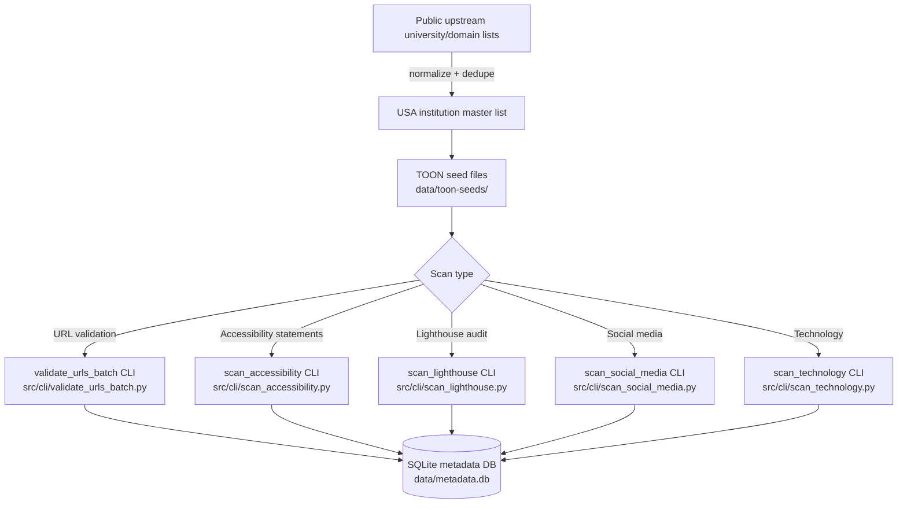

# edu-scans

[](LICENSE)
[](https://github.com/mgifford/edu-scans/actions/workflows/deploy-pages.yml)
[](https://mgifford.github.io/edu-scans/)

Scans and seed datasets for finding accessibility statements and related web signals on
United States educational institution websites, with an emphasis on `.edu` domains and the
April 2027 WCAG 2.1 AA compliance horizon for public higher-education institutions.

## Overview

This repository is being repurposed from an earlier government-domain project into a USA
educational-institution scanning pipeline. The target scope is:

- United States colleges and universities
- Public and private higher-education institutions that publish on `.edu` domains
- Seed-domain aggregation, de-duplication, URL validation, and downstream scanning

The codebase already contains working scanners for:

- URL validation
- Accessibility statement detection
- Lighthouse audits
- Social media detection
- Technology detection
- Third-party JavaScript detection

What is still in progress is the dataset migration. The legacy `.gov` and EU-focused seed data
has been removed, and the replacement USA `.edu` TOON seeds have not been generated yet.

## Current Status

The repository is currently in a migration phase.

- The old government seed files are gone.
- No committed `.toon` seed files are present under `data/toon-seeds/` yet.
- Much of the scanner code still expects legacy TOON defaults such as
    `data/toon-seeds/countries/` and the legacy `--country` CLI flag.
- The next milestone is to build a normalized USA institution master list and emit TOON seed
    files that the existing scanners can consume.

If you are looking for a ready-to-run institutional dataset in this repository today, it is not
here yet. The seed-generation pipeline is the active migration task.

## Planned Source Lists

The current plan is to aggregate, document, and de-duplicate USA higher-education domains from
multiple public datasets, including:

- `nickdenardis/edu-inventory`
- `Hipo/university-domains-list`
- `abadojack/swot`
- `matlin/node-university-domains`
- `mohsennazari/academic-domains-dataset`

These sources differ in quality and shape:

- Some are institution-first lists with names, country labels, and website URLs.
- Some are domain inventories with little or no institution metadata.
- Some include subdomains or non-`.edu` academic domains that must be filtered for the USA use case.
- Some contain stale or incorrect entries that will need validation and merge rules.

The repository goal is not to mirror any one upstream list verbatim. The goal is to produce one
documented, reproducible USA institution seed set with source provenance.

## How The Pipeline Is Intended To Work



## Repository Layout

- `data/imports/` raw source files and generated intermediate inputs
- `data/toon-seeds/` version-controlled TOON seed files once generated
- `docs/` public documentation and GitHub Pages content
- `scripts/` utility scripts, including seed-generation work in progress
- `src/cli/` command-line entry points for scanning and report generation
- `src/jobs/` batch-oriented scanner jobs that process TOON files
- `src/services/` reusable service logic and orchestration
- `src/storage/` schema bootstrap and metadata persistence
- `tests/` unit, integration, and contract tests

## TOON Seed Format

The existing scanners expect TOON-like JSON seed files with a structure along these lines:

```json
{
    "version": "0.1-seed",
    "country": "INSTITUTION_OR_GROUP_LABEL",
    "domains": [
        {
            "canonical_domain": "example.edu",
            "pages": [
                {
                    "url": "https://example.edu/",
                    "is_root_page": true
                }
            ]
        }
    ]
}
```

That schema is still carrying legacy field names such as `country`. During the migration, the
priority is compatibility first: produce seed files the scanners can read, then rename the
abstractions cleanly afterward.

## Running The Existing Scanners

The scanners are usable once TOON seed files exist, but some command names and defaults still
reflect the earlier data model.

Typical commands:

```bash
# Install Python dependencies
pip install -r requirements.txt

# Run tests
python3 -m pytest tests/ -v

# Validate all seed files once they exist
python3 -m src.cli.validate_urls --all --rate-limit 2

# Run a batch validation cycle
python3 -m src.cli.validate_urls_batch --batch-mode --batch-size 2

# Run Lighthouse scans
python3 -m src.cli.scan_lighthouse --all --max-runtime 110 --rate-limit 0.2
```

Important caveat:

- Several CLIs still default to `data/toon-seeds/countries/`.
- Those defaults will need to be updated as part of the `.edu` migration.
- Until the new seeds are generated, many scan commands will fail because there are no `.toon`
    inputs to process.

## Running Tests Locally

```bash
pip install -r requirements.txt
python3 -m pytest tests/ -v
```

Focused examples:

```bash
python3 -m pytest tests/unit/ -v
python3 -m pytest tests/integration/ -v
ruff check path/to/file.py tests/path/to/test_file.py
```

For the GitHub Pages accessibility smoke tests:

```bash
npm ci
npx playwright install --with-deps chromium
python3 -m http.server 4000 --directory _site
```

Then in a second terminal:

```bash
A11Y_SITE_DIR=_site A11Y_BASE_URL=http://127.0.0.1:4000 npm run test:a11y
```

## Data Storage

The validation system uses an SQLite database at `data/metadata.db` to store:

- URL validation results
- Redirect history
- Failure counts across runs
- Scan outputs used by reports
- Batch-processing state

This database is not committed to git.

Validated or annotated TOON outputs are also not committed. Only the original seed files are
intended to be version-controlled.

## AI Disclosure

This project is committed to transparency about build-time AI assistance.

| Tool / LLM | What it was used for |
|---|---|
| GitHub Copilot (GPT-5.4) | Code edits, refactoring, repository migration work, documentation updates, and implementation assistance in VS Code |
| Claude (Anthropic) | PR reviews, documentation editing, and code-generation assistance during repository maintenance |
| ChatGPT / GPT-4 / GPT-5 (OpenAI) | Design review, implementation review, debugging help, and documentation/report-generation assistance |

No AI model runs as part of the application at runtime.

## Next Steps

- Build the USA `.edu` source aggregation script
- Document each upstream source and its normalization rules
- Generate the first committed TOON seed files for USA educational institutions
- Update scanner defaults away from `data/toon-seeds/countries/`
- Add focused tests for seed generation and de-duplication
