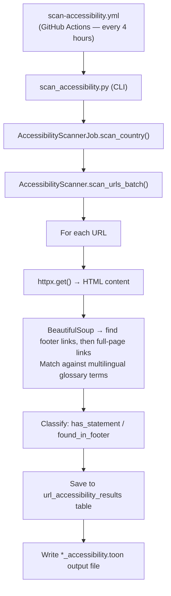

<!-- ACCESSIBILITY_STATS_START -->

_Stats as of 2026-05-14 06:24 UTC — last scan: 2026-05-14_

**22** scan batches run

**6,095** of **7,626** available domains scanned (**79.9%** coverage)
**5,128** of **6,095** scanned domains were reachable (**84.1%**)
**1,927** of **5,128** reachable domains have an accessibility statement (**37.6%**)
**1,552** domains have the statement link in the footer (**80.5%** of domains with a statement)

📥 Machine-readable results are available as the [accessibility-data.json artifact (machine-readable JSON)](https://github.com/mgifford/eu-plus-government-scans/actions/workflows/generate-scan-progress.yml).

Each country entry in the JSON file includes page-level evidence for pages with and without accessibility statements, plus a per-domain summary you can share to validate the published counts.

> Hover or focus any non-zero count in the country table to preview the matching pages. If there are 20 or fewer URLs, the preview shows all of them; otherwise it shows a short sample. Full machine-readable data is available as the [accessibility-data.json artifact (machine-readable JSON)](https://github.com/mgifford/eu-plus-government-scans/actions/workflows/generate-scan-progress.yml).

---

## Accessibility Statement Scan by Country

| Country | Domains | Available | Reachable | Has Statement | In Footer | Statement % | Scan Period |
|---------|---------|-----------|-----------|--------------|-----------|------------|-------------|
| Usa Edu Master | 3,780 | 3,763 | 2,821 | 1,278 | 1,055 | 45.3% | Apr 2026 – May 2026 |
| Usa Edu Master Subdomains | 3,231 | 3,763 | 2,978 | 913 | 724 | 30.7% | May 2026 |
| Usa Edu Top100 | 101 | 100 | 90 | 59 | 57 | 65.6% | Apr 2026 – May 2026 |
| **Total** | **7,112** | **7,626** | **5,889** | **2,250** | **1,836** | **38.2%** | — |

> **Statement %** is the percentage of *reachable* domains that contain at least one link to an accessibility statement.

<!-- ACCESSIBILITY_STATS_END -->

---

## Overview

The accessibility statement scanner checks whether each institution page links
to an **accessibility statement**.

As a best-practice baseline, public-facing institutions should:

1. Publish an accessibility statement describing the accessibility of their
   website or mobile app.
2. Include a clearly labelled link to that statement on the page, ideally in
   the footer.

The scanner detects these links using multilingual term matching.

Scans run **automatically every 4 hours** via GitHub Actions so coverage grows
progressively without overloading institutional servers.

---

## What Is Checked

For each scanned page the scanner:

1. Fetches the page HTML.
2. Searches **first inside `<footer>` elements** for links whose text or href
   matches known accessibility-statement terminology.
3. If not found in the footer, searches the **entire page**.
4. Records whether a matching link was found, where it was found (footer or
   page body), and what text triggered the match.

---

## Multilingual Term Matching

The glossary covers the following languages:

| Region | Languages |
|--------|----------|
| EU official languages | Bulgarian, Croatian, Czech, Danish, Dutch, English, Estonian, Finnish, French, German, Greek, Hungarian, Irish, Italian, Latvian, Lithuanian, Maltese, Polish, Portuguese, Romanian, Slovak, Slovenian, Spanish, Swedish |
| Allied nations | Icelandic, Norwegian |

Example recognised terms include *"accessibility statement"* (EN),
*"déclaration d'accessibilité"* (FR), *"Erklärung zur Barrierefreiheit"* (DE),
and equivalents in all supported languages.

---

## Tier Classification

Each scanned page is assigned one of three outcomes:

| Outcome | Meaning |
|---------|---------|
| `unreachable` | Page could not be fetched (network error, timeout, 4xx/5xx) |
| `no_statement` | Page is reachable but no accessibility statement link was found |
| `has_statement` | Page contains at least one link to an accessibility statement |

Pages where the statement link was found inside a `<footer>` element are
additionally flagged with `found_in_footer = true`, since placing the link in
the footer is considered best practice.

---

## Viewing Results

### Scan Progress Report

The **[Scan Progress Report](scan-progress.md)** includes a per-seed
accessibility statement breakdown showing:

- Total pages scanned and reachable count
- Number of pages with a statement link
- Number of pages where the link was found in the footer
- Date range showing when each seed was last scanned

### GitHub Actions Artifacts

Each workflow run uploads a scan artifact containing:

- `data/metadata.db` — the full SQLite results database
- `accessibility-scan-output.txt` — the raw scan log
- `data/toon-seeds/**_accessibility.toon` — annotated TOON files

To download artifacts:

1. Go to [GitHub Actions → Scan Accessibility Statements](https://github.com/mgifford/edu-scans/actions/workflows/scan-accessibility.yml)
2. Click on the relevant workflow run
3. Scroll to the **Artifacts** section at the bottom of the run summary page
4. Download `accessibility-scan-<run_number>` to inspect the database or TOON files

---

## Running a Scan Manually

### Via GitHub Actions (recommended)

1. Go to [Actions → Scan Accessibility Statements](https://github.com/mgifford/edu-scans/actions/workflows/scan-accessibility.yml)
2. Click **Run workflow**
3. Optionally enter a seed code (e.g. `USA_EDU_MASTER`) or leave blank to scan all seed files
4. Optionally adjust the rate limit (default: 1.0 req/sec)

### Via the command line

```bash
# Scan a single seed
python3 -m src.cli.scan_accessibility --country USA_EDU_MASTER --rate-limit 1.0

# Scan all seed files (with a 110-minute runtime cap)
python3 -m src.cli.scan_accessibility --all --max-runtime 110 --rate-limit 1.0
```

---

## Output Format

### Annotated TOON file (`*_accessibility.toon`)

Each page entry gains an `accessibility` field:

```json
{
  "url": "https://example.gov/",
  "is_root_page": true,
  "accessibility": {
    "is_reachable": true,
    "has_statement": true,
    "found_in_footer": true,
    "statement_links": ["https://example.gov/accessibility"],
    "matched_terms": ["accessibility statement"]
  }
}
```

### Database table (`url_accessibility_results`)

| Column | Type | Description |
|--------|------|-------------|
| `url` | TEXT | Page URL |
| `country_code` | TEXT | Legacy field name for seed identifier (e.g. `USA_EDU_MASTER`) |
| `scan_id` | TEXT | Unique scan run identifier |
| `is_reachable` | INTEGER | 1 = reachable, 0 = not reachable |
| `has_statement` | INTEGER | 1 = accessibility statement link found |
| `found_in_footer` | INTEGER | 1 = link was found inside a `<footer>` element |
| `statement_links` | TEXT | JSON list of resolved statement URLs |
| `matched_terms` | TEXT | JSON list of matched glossary terms |
| `error_message` | TEXT | Error message if fetch failed |
| `scanned_at` | TEXT | ISO-8601 timestamp of scan |

---

## Coverage Scope

Scans currently target United States higher-education institutions in the
seed set.

---

## Architecture


