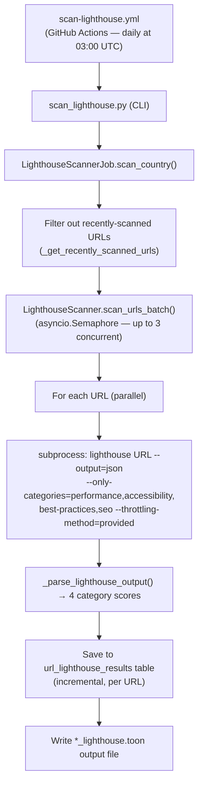

<!-- LIGHTHOUSE_STATS_START -->

_Stats as of 2026-04-25 18:51 UTC — last scan: 2026-04-24_

**1** scan batches run

**624** of **3,763** available pages audited (**16.6%** coverage)
**453** successful audits (**72.6%** of audited)

**Overall average Lighthouse scores** (0–100 scale):

| Performance | Accessibility | Best Practices | SEO |
|:-----------:|:-------------:|:--------------:|:---:|
| 86 | 89 | 66 | 90 |

---

## Lighthouse Scores by Country

| Country | Audited | Available | Perf | A11y | Best Practices | SEO | Last Scan |
|---------|--------:|----------:|:----:|:----:|:--------------:|:---:|-----------|
| Usa Edu Master | 624 | 3,763 | 86 | 89 | 66 | 90 | 2026-04-24 |

> Scores are averages across all successfully audited URLs, displayed as 0–100 (Lighthouse stores scores as 0.0–1.0 internally).

---

## Lighthouse Scores by Institution

| Institution | Domain | Audited | Perf | A11y | Best Practices | SEO |
|-------------|--------|--------:|:----:|:----:|:--------------:|:---:|
| Anne Arundel Community College | aacc.edu | 1 | 92 | 89 | 54 | 83 |
| Arizona Automotive Institute | aai.edu | 1 | 99 | 91 | 54 | 100 |
| Alabama Agricultural and Mechanical University | aamu.edu | 1 | — | — | — | — |
| Arab American University - Jenin | aauj.edu | 1 | — | — | — | — |
| Alderson Broaddus College | ab.edu | 1 | — | — | — | — |
| Abraham Baldwin Agricultural College | abac.edu | 1 | 97 | 80 | 58 | 82 |
| Bible Colleges | abc.edu | 1 | 97 | 60 | 77 | 92 |
| American Baptist College | abcnash.edu | 1 | 88 | 88 | 77 | 92 |
| American Bible College & Seminary | abcs.edu | 1 | — | — | — | — |
| American Baptist Seminary of the West | absw.edu | 1 | — | — | — | — |
| Asheville-Buncombe Technical Community College | abtech.edu | 1 | 93 | 100 | 58 | 85 |
| Atlanta College of Art | aca.edu | 1 | — | — | — | — |
| Academy of Art University | academyart.edu | 1 | 84 | 89 | 58 | 85 |
| Academy College | academycollege.edu | 1 | 79 | 97 | 100 | 85 |
| Acadiana Technical College | acadiana.edu | 1 | — | — | — | — |
| American College of Acupuncture & Oriental Medicine | acaom.edu | 1 | 71 | 79 | 58 | 85 |
| Atlanta Christian College | acc.edu | 1 | — | — | — | — |
| American College of Healthcare Sciences | achs.edu | 1 | 88 | 88 | 54 | 92 |
| ACM — Associated Colleges of the Midwest — Home | acm.edu | 1 | 93 | 82 | 100 | 77 |
| Albertson College of Idaho | acofi.edu | 1 | — | — | — | — |
| Appalachian College of Pharmacy | acp.edu | 1 | 96 | 85 | 54 | 85 |
| Albany College of Pharmacy and Health Sciences (ACPHS) | acphs.edu | 1 | 93 | 100 | 38 | 85 |
| American College of Thessaloniki | act.edu | 1 | 51 | 88 | 35 | 92 |
| American College of Traditional Chinese Medicine | actcm.edu | 1 | — | — | — | — |
| Amarillo College | actx.edu | 1 | — | — | — | — |
| Abilene Christian University, a Christian college in Abilene, Texas | acu.edu | 1 | 72 | 98 | 96 | 92 |
| Adams State College | adams.edu | 1 | 93 | 80 | 58 | 100 |
| Adelphi University | adelphi.edu | 1 | 78 | 87 | 58 | 100 |
| Adrian College | adrian.edu | 1 | 65 | 96 | 92 | 100 |
| Adrian\'s Beauty Colleges | adrians.edu | 1 | 99 | 75 | 77 | 92 |
| Career College Los Angeles | advancedcollege.edu | 1 | — | — | — | — |
| AFI Conservatory | afi.edu | 1 | 85 | 84 | 88 | 77 |
| Air Force Institute of Technology | afit.edu | 1 | — | — | — | — |
| Africa University | africau.edu | 1 | 76 | 68 | 73 | 77 |
| Agnes Scott College | agnesscott.edu | 1 | 85 | 87 | 54 | 83 |
| Alahgaff University | ahgaff.edu | 1 | 82 | 66 | 42 | 100 |
| American Healthcare Institute Continuing Education Nurses Mental Health Professionals Maryland | ahi.edu | 1 | — | — | — | — |
| Aquinas Institute of Theology > Home | ai.edu | 1 | 90 | 98 | 81 | 92 |
| American Institute of Alternative Medicine AIAM | aiam.edu | 1 | 97 | 79 | 54 | 92 |
| American International College | aic.edu | 1 | 87 | 77 | 46 | 69 |
| American Indian College of the Assemblies of God | aicag.edu | 1 | 89 | 78 | 62 | 92 |
| American Islamic College | aicusa.edu | 1 | 99 | 63 | 96 | 85 |
| American Institute of Holistic Theology | aiht.edu | 1 | — | — | — | — |
| All India Institute of Medical Sciences, New Delhi, INDIA | aiims.edu | 1 | 36 | 60 | 50 | 73 |
| Aims Community College | aims.edu | 1 | 95 | 100 | 58 | 85 |
| AIMT American Institute of Medical Technology | aimt.edu | 1 | — | — | — | — |
| Atlantic International University | aiu.edu | 1 | 92 | 76 | 54 | 92 |
| American International University - Bangladesh | aiub.edu | 1 | 56 | 94 | 96 | 100 |
| American InterContinental University – AIU South Florida Campus Homepage | aiufl.edu | 1 | — | — | — | — |
| American InterContinental University | aiuniv.edu | 1 | 91 | 82 | 54 | 85 |
| Association of Jesuit Colleges and Universities | ajcunet.edu | 1 | 94 | 91 | 100 | 92 |
| Alaska Bible College | akbible.edu | 1 | 97 | 93 | 77 | 100 |
| Aga Khan University | aku.edu | 1 | 63 | 78 | 73 | 85 |
| Alamance Community College | alamancecc.edu | 1 | 79 | 98 | 58 | 77 |
| Alameda Beauty College & Beauty School Of Cosmetology – Bay Area | alamedabeautycollege.edu | 1 | — | — | — | — |
| Alamo Colleges District | alamo.edu | 1 | 84 | 79 | 54 | 77 |
| Alaska Career College | alaskacareercollege.edu | 1 | 75 | 90 | 96 | 100 |
| Alaska Pacific University — Discover Active Learning | alaskapacific.edu | 1 | 94 | 84 | 58 | 92 |
| Alaska Pacific University — Discover Active Learning | alasu.edu | 1 | 94 | 92 | 54 | 100 |
| Albright College | alb.edu | 1 | — | — | — | — |
| Albany Technical College | albanytech.edu | 1 | 98 | 97 | 46 | 85 |
| Carlos Albizu University | albion.edu | 1 | 84 | 92 | 58 | 85 |
| Alice Lloyd College | alc.edu | 1 | 94 | 80 | 50 | 69 |
| Alcorn State University | alcorn.edu | 1 | 94 | 85 | 35 | 92 |
| Alexandria Technical & Community College | alextech.edu | 1 | 91 | 87 | 73 | 100 |
| Alfred University | alfred.edu | 1 | 77 | 100 | 58 | 100 |
| Alfred State College | alfredstate.edu | 1 | 78 | 100 | 58 | 100 |
| Allegheny College | alleg.edu | 1 | — | — | — | — |
| Allegany College of Maryland | allegany.edu | 1 | 41 | 88 | 58 | 83 |
| Allen County Community College | allencc.edu | 1 | 91 | 93 | 54 | 92 |
| Allentown College of Saint Francis de Sales | allencol.edu | 1 | — | — | — | — |
| Allen College | allencollege.edu | 1 | 100 | 94 | 100 | 92 |
| Allen University | allenuniversity.edu | 1 | 94 | 96 | 92 | 85 |
| Alliant International University; California Graduate Schools, Graduate Degrees; Undergraduate Bachelors Completion Degrees | alliant.edu | 1 | 94 | 99 | 58 | 100 |
| Alma College | alma.edu | 1 | 99 | 93 | 58 | 92 |
| Alpena Community College, Alpena, Michigan, USA | alpenacc.edu | 1 | 90 | 87 | 100 | 91 |
| Al-Quds University - The Arab University in Jerusalem | alquds.edu | 1 | 31 | 78 | 62 | 92 |
| Altamaha Technical College | altamahatech.edu | 1 | — | — | — | — |
| Abraham Lincoln University | alu.edu | 1 | 94 | 95 | 54 | 92 |
| Alvernia University | alvernia.edu | 1 | 84 | 82 | 54 | 85 |
| Alverno College | alverno.edu | 1 | 86 | 86 | 54 | 85 |
| Alvin Community College | alvincollege.edu | 1 | 100 | 92 | 69 | 92 |
| Ambassador University | ambassador.edu | 1 | 94 | 95 | 96 | 61 |
| Ambassador Baptist College | ambassadors.edu | 1 | 70 | 92 | 96 | 92 |
| Amberton University | amberton.edu | 1 | 91 | 92 | 58 | 85 |
| Anderson Medical Career College | amcc.edu | 1 | — | — | — | — |
| American College Dublin | amcd.edu | 1 | — | — | — | — |
| American Coastline University | amercoastuniv.edu | 1 | — | — | — | — |
| American University Washington D.C. | american.edu | 1 | 76 | 100 | 46 | 83 |
| American Career College | americancareercollege.edu | 1 | 78 | 96 | 54 | 92 |
| American Institute | americaninstitute.edu | 1 | 100 | 94 | 38 | 100 |
| American Institute for Paralegal Studies | americanparalegal.edu | 1 | — | — | — | — |
| Amherst College | amherst.edu | 1 | 97 | 86 | 77 | 85 |
| amridgeuniversity.edu | amridgeuniversity.edu | 1 | — | — | — | — |
| Amrita University | amrita.edu | 1 | 57 | 85 | 77 | 100 |
| Anaheim University | anaheim.edu | 1 | 84 | 87 | 73 | 92 |
| Anamarc College | anamarc.edu | 1 | — | — | — | — |
| Arkansas Northeastern College | anc.edu | 1 | 99 | 90 | 77 | 92 |
| Ancilla College | ancilla.edu | 1 | — | — | — | — |
| Aaniiih Nakoda College | ancollege.edu | 1 | 100 | 95 | 96 | 92 |
| Anderson University | anderson.edu | 1 | 90 | 84 | 54 | 85 |
| Andrew College | andrewcollege.edu | 1 | 62 | 96 | 54 | 100 |
| Andrews University | andrews.edu | 1 | 94 | 79 | 54 | 100 |
| Angeles Institute | angelesinstitute.edu | 1 | 97 | 95 | 54 | 77 |
| Angelina College | angelina.edu | 1 | 95 | 91 | 54 | 92 |
| Angelo State University | angelo.edu | 1 | 97 | 96 | 58 | 100 |
| Anna Maria College | annamaria.edu | 1 | 73 | 76 | 54 | 85 |
| Anoka Technical College Home | anokatech.edu | 1 | 95 | 93 | 50 | 100 |
| ::AKKINENI NAGESWARA RAO COLLEGE,GUDIVADA:: | anrcollege.edu | 1 | 58 | 60 | 69 | 82 |
| Antioch University | antioch.edu | 1 | 86 | 88 | 58 | 77 |
| Antioch University - Los Angeles | antiochla.edu | 1 | 79 | 88 | 58 | 77 |
| Antioch University New England | antiochne.edu | 1 | 70 | 88 | 58 | 77 |
| Antioch University Santa Barbara | antiochsb.edu | 1 | 89 | 88 | 58 | 77 |
| Antioch University - Seattle | antiochsea.edu | 1 | 74 | 88 | 58 | 77 |
| Antonelli Institute Art & Photography | antonelli.edu | 1 | — | — | — | — |
| American Professional Institute | api.edu | 1 | — | — | — | — |
| Appalachian State University | appstate.edu | 1 | 77 | 98 | 35 | 92 |
| Austin Peay State University | apsu.edu | 1 | 99 | 95 | 58 | 100 |
| Asia Pacific Theological Seminary (APTS) | apts.edu | 1 | 75 | 86 | 100 | 92 |
| A Top Christian College in Southern California | apu.edu | 1 | 88 | 96 | 58 | 100 |
| American Public University System | apus.edu | 1 | 93 | 97 | 54 | 85 |
| Aquinas College | aquinas.edu | 1 | 90 | 91 | 58 | 85 |
| Arapahoe Community College in Colorado | arapahoe.edu | 1 | 89 | 99 | 54 | 92 |
| Arcadia University | arcadia.edu | 1 | 94 | 93 | 54 | 100 |
| Arellano University School of Law | arellanolaw.edu | 1 | 61 | 80 | 96 | 75 |
| Argosy University | argosy.edu | 2 | — | — | — | — |
| Arizona Christian University | arizonachristian.edu | 1 | 91 | 89 | 54 | 92 |
| Arkansas Baptist College | arkansasbaptist.edu | 1 | 99 | 95 | 100 | 100 |
| Arlington Baptist College | arlingtonbaptistcollege.edu | 1 | — | — | — | — |
| Armstrong Atlantic State University Savannah, GA | armstrong.edu | 1 | — | — | — | — |
| Army Warrior University | army.edu | 1 | — | — | — | — |
| Art Center College of Design | artcenter.edu | 1 | 100 | 68 | 58 | 83 |
| ASA College | asa.edu | 1 | — | — | — | — |
| Asbury University | asbury.edu | 1 | 95 | 91 | 54 | 92 |
| Asbury Theological Seminary | asburyseminary.edu | 1 | 68 | 94 | 54 | 92 |
| Alabama Southern Community College | ascc.edu | 1 | 75 | 77 | 96 | 58 |
| Ashford University | ashford.edu | 1 | — | — | — | — |
| Ashland University | ashland.edu | 1 | 87 | 94 | 58 | 100 |
| Ashmead College Is Now Everest College | ashmead.edu | 1 | — | — | — | — |
| Asian Institute of Medical Studies, a School of Acupuncture and Oriental Medicine in Tucson | asianinstitute.edu | 1 | — | — | — | — |
| Asia Pacific Institute of Management | asiapacific.edu | 1 | 57 | 77 | 50 | 83 |
| Asnuntuck Community College | asnuntuck.edu | 1 | — | — | — | — |
| Assumption College | assumption.edu | 1 | 98 | 98 | 54 | 92 |
| Arkansas State University | astate.edu | 1 | 90 | 93 | 69 | 100 |
| Arizona State University | asu.edu | 1 | 94 | 96 | 50 | 85 |
| Arkansas State University, Beebe | asub.edu | 1 | 77 | 76 | 77 | 92 |
| Arkansas State University, Mountain Home | asumh.edu | 1 | 66 | 80 | 58 | 92 |
| Arkansas State University, Newport | asun.edu | 1 | 95 | 100 | 73 | 92 |
| Albany State University | asurams.edu | 1 | 94 | 91 | 69 | 92 |
| ATA College | ata.edu | 1 | 96 | 83 | 54 | 92 |
| Aiken Technical College | atc.edu | 1 | — | — | — | — |
| Associated Technical College_Home_Los Angeles | atcla.edu | 1 | 100 | 100 | 100 | 92 |
| Ateneo de Manila University | ateneo.edu | 1 | — | — | — | — |
| Athabasca University | athabasca.edu | 1 | — | — | — | — |
| Athena College of Beauty | athenacollege.edu | 1 | — | — | — | — |
| Athens State University | athens.edu | 1 | 88 | 95 | 50 | 100 |
| Athens Technical College | athenstech.edu | 1 | 86 | 100 | 58 | 92 |
| ATI College | ati.edu | 1 | 94 | 97 | 77 | 92 |
| Atlanta Technical College | atlantatech.edu | 1 | 87 | 95 | 73 | 92 |
| Atlantic Cape Community College | atlantic.edu | 1 | 91 | 86 | 54 | 85 |
| Atlantic University College | atlanticu.edu | 1 | 95 | 74 | 73 | 92 |
| Atlantic University | atlanticuniv.edu | 1 | 100 | 83 | 100 | 92 |
| Atria Institute of Technology, Bangalore, India | atria.edu | 1 | 58 | 78 | 96 | 91 |
| ATS Institute of Technology | atsinstitute.edu | 1 | 61 | 52 | 65 | 91 |
| Arkansas Tech University | atu.edu | 1 | 94 | 85 | 54 | 92 |
| Assumption University of Thailand | au.edu | 1 | — | — | — | — |
| American University of Beirut | aub.edu | 1 | 92 | 95 | 58 | 85 |
| American University in Bulgaria | aubg.edu | 1 | 94 | 89 | 58 | 92 |
| American University of Biblical Studies | aubs.edu | 1 | — | — | — | — |
| Auburn University | auburn.edu | 1 | 90 | 100 | 96 | 92 |
| American University in Cairo | aucegypt.edu | 1 | — | — | — | — |
| Atlanta University Center Consortium, Inc. | aucenter.edu | 1 | — | — | — | — |
| :: American University in Dubai :: | aud.edu | 1 | 61 | 92 | 50 | 75 |
| Augustana College (SD) | augie.edu | 1 | 98 | 81 | 73 | 92 |
| Augsburg College | augsburg.edu | 1 | 96 | 97 | 77 | 100 |
| Augusta University | augusta.edu | 1 | 73 | 100 | 54 | 100 |
| Augustana College (IL) | augustana.edu | 1 | 100 | 93 | 54 | 92 |
| Augusta Technical College | augustatech.edu | 1 | 72 | 82 | 54 | 83 |
| American University for Humanities | auh.edu | 1 | — | — | — | — |
| Auburn University at Montgomery | aum.edu | 1 | 60 | 88 | 58 | 69 |
| Aurora University | aurora.edu | 1 | 95 | 100 | 54 | 92 |
| Ahsanullah University of Science & Technology | aus.edu | 1 | 63 | 62 | 54 | 85 |
| Austin Community College | austincc.edu | 1 | 88 | 89 | 54 | 92 |
| Austin College | austincollege.edu | 1 | — | 93 | 54 | 92 |
| Austin Presbyterian Theological Seminary | austinseminary.edu | 1 | — | — | — | — |
| American University College of Technology | aut.edu | 1 | 90 | 90 | 92 | 92 |
| Advanced Technology Institute | auto.edu | 1 | 95 | 99 | 77 | 100 |
| Avancé Beauty College — Train for an Exciting Career in Cosmetology | avancebeautycollege.edu | 1 | — | — | — | — |
| Antelope Valley College | avc.edu | 1 | — | — | — | — |
| Ave Maria University > Home | avemaria.edu | 1 | 94 | 79 | 96 | 83 |
| Averett College | averett.edu | 1 | 89 | 75 | 35 | 85 |
| Avila College | avila.edu | 1 | 49 | 100 | 54 | 92 |
| Avinashilingam University for Women, Coimbatore, India | avinashilingam.edu | 1 | — | — | — | — |
| AZURE COLLEGE, Great in Demand Career Programs | azure.edu | 1 | — | — | — | — |
| Arizona Western College | azwestern.edu | 1 | 93 | 100 | 100 | 77 |
| Barber-Scotia College | b-sc.edu | 1 | 69 | 92 | 92 | 85 |
| Broken Arrow Beauty College & Cosmetology Education Center | babeautycollege.edu | 1 | — | — | — | — |
| Babson College | babson.edu | 1 | 74 | 100 | 54 | 92 |
| Belmont Abbey College, Charlotte, NC | bac.edu | 1 | 56 | 75 | 54 | 92 |
| Bacone College | bacone.edu | 1 | — | — | — | — |
| Bainbridge State College | bainbridge.edu | 1 | — | — | — | — |
| Bakersfield College | bakersfieldcollege.edu | 1 | 95 | 100 | 77 | 92 |
| Bakersfield College | bakeru.edu | 1 | 49 | 100 | 50 | 100 |
| Baldwin-Wallace College | baldwinw.edu | 1 | — | — | — | — |
| Baptist University of America | baptist.edu | 1 | — | — | — | — |
| Bapuji Dental College And Hospital | bapujidental.edu | 1 | 74 | 92 | 69 | 100 |
| Barclay College | barclaycollege.edu | 1 | 76 | 72 | 73 | 77 |
| Bard College | bard.edu | 1 | 91 | 100 | 73 | 100 |
| Barnard College | barnard.edu | 1 | 94 | 88 | 100 | 92 |
| Barry University, Miami Shores, Florida | barry.edu | 1 | 67 | 100 | 54 | 92 |
| Barry University, Miami Shores, Florida | barstow.edu | 1 | 44 | 90 | 73 | 77 |
| Barton County Community College | bartonccc.edu | 1 | 94 | 95 | 54 | 92 |
| Baruch College | baruch.edu | 1 | 81 | 80 | 50 | 85 |
| Bastyr University | bastyr.edu | 1 | — | 99 | 58 | 85 |
| Bates College | bates.edu | 1 | 92 | 98 | 54 | 100 |
| Bay Atlantic University | bau.edu | 1 | 86 | 67 | 35 | 100 |
| Bay de Noc Community College | baycollege.edu | 1 | 81 | 98 | 73 | 85 |
| Baylor University | baylor.edu | 1 | 92 | 97 | 58 | 100 |
| Bay Path University | baypath.edu | 1 | 78 | 79 | 54 | 92 |
| Bay State · Bay State College | baystate.edu | 1 | — | — | — | — |
| Accredited Christian Bible College & Seminary | bbc.edu | 1 | — | — | — | — |
| Boston College | bc.edu | 1 | 94 | 90 | 58 | 92 |
| Butler County Community College | bc3.edu | 1 | 91 | 100 | 96 | 92 |
| Baptist College of America | bca.edu | 1 | 92 | 82 | 77 | 85 |
| Baltimore City Community College | bccc.edu | 1 | 87 | 100 | 73 | 85 |
| blueridge college of evangelism, christian bible colleges in wytheville va | bce.edu | 1 | 100 | 63 | 88 | 91 |
| Baylor College of Medicine | bcm.edu | 1 | 99 | 100 | 54 | 92 |
| Beacon College for ADHD Students, LD Students and gifted LD | beaconcollege.edu | 1 | 90 | 88 | 73 | 85 |
| Beaufort County Community College | beaufortccc.edu | 1 | 96 | 92 | 96 | 92 |
| Becker College | becker.edu | 1 | — | — | — | — |
| Belhaven University | belhaven.edu | 1 | 84 | 100 | 54 | 83 |
| Bellarmine University | bellarmine.edu | 1 | 94 | 100 | 54 | 85 |
| Bellarmine University | bellevue.edu | 1 | 78 | 92 | 54 | 92 |
| Bellevue College, Washington [Previously Bellevue Community College] | bellevuecollege.edu | 1 | 100 | 96 | 54 | 100 |
| Bellmar Chicago Beauty College | bellmar.edu | 1 | — | — | — | — |
| Belmont University | belmont.edu | 1 | 94 | 88 | 54 | 100 |
| Belmont College | belmontcollege.edu | 1 | 96 | 76 | 73 | 77 |
| Bemidji State University | bemidjistate.edu | 1 | 95 | 90 | 54 | 92 |
| Benedictine University Benedictine University | ben.edu | 1 | 99 | 100 | 54 | 100 |
| Benedictine University Benedictine University | benedict.edu | 1 | 94 | 95 | 96 | 92 |
| Benedictine College | benedictine.edu | 1 | 96 | 94 | 58 | 92 |
| bennett.edu | bennett.edu | 1 | 89 | 91 | 92 | 83 |
| Bennington College | bennington.edu | 1 | 91 | 100 | 77 | 92 |
| Bentley University | bentley.edu | 1 | 61 | 90 | 54 | 92 |
| Berean University of the Assemblies of God | berea.edu | 1 | 78 | 92 | 58 | 100 |
| Bergen Community College Homepage | bergen.edu | 1 | 94 | 72 | 50 | 85 |
| Bergin University of Canine Studies | berginu.edu | 1 | 72 | 81 | 31 | 92 |
| Berkeley College | berkeleycollege.edu | 1 | 87 | 95 | 54 | 77 |
| Berklee College of Music | berklee.edu | 1 | 94 | 95 | 77 | 100 |
| Berry College | berry.edu | 1 | 93 | 95 | 54 | 92 |
| Bethany College California | bethany.edu | 1 | 100 | 72 | 65 | 91 |
| Bethany Divinity College and Seminary | bethanybc.edu | 1 | 99 | 93 | 100 | 92 |
| Bethany Theological Seminary | bethanyseminary.edu | 1 | 100 | 68 | 81 | 85 |
| Bethany College | bethanywv.edu | 1 | 80 | 73 | 54 | 77 |
| Bethel College St. Paul | bethel.edu | 1 | 84 | 88 | 58 | 100 |
| Bethel College, Mishawaka IN | bethelcollege.edu | 1 | — | — | — | — |
| Bethel College Newton | bethelks.edu | 1 | 85 | 90 | 96 | 85 |
| Bethlehem University | bethlehem.edu | 1 | 57 | 89 | 54 | 69 |
| Bethlehem Bible College كلية بيت لح٠للكتاب ال٠قدس | bethlehembiblecollege.edu | 1 | — | — | — | — |
| Blackfeet Community College | bfcc.edu | 1 | 73 | 85 | 77 | 75 |
| Benjamin Franklin Institute of Technology | bfit.edu | 1 | 100 | 80 | 54 | 100 |
| Bainbridge Graduate Institute · The Pioneer of Sustainable Business Education | bgi.edu | 1 | — | — | — | — |
| Bowling Green State University | bgsu.edu | 1 | 93 | 95 | 54 | 100 |
| Bhavnagar University Official Website | bhavuni.edu | 1 | — | — | — | — |
| Black Hawk College | bhc.edu | 1 | 95 | 100 | 58 | 100 |
| BH Carroll Theological Institute | bhcarroll.edu | 1 | — | — | — | — |
| Black Hills State University | bhsu.edu | 1 | 90 | 100 | 54 | 92 |
| Baltimore Hebrew University | bhu.edu | 1 | — | — | — | — |
| Biblical Seminary | biblical.edu | 1 | — | — | — | — |
| Baltimore International College Foundation | bic.edu | 1 | — | — | — | — |
| Big Bend Community College | bigbend.edu | 1 | 93 | 93 | 92 | 77 |
| Bilkent University | bilkent.edu | 1 | 42 | 75 | 77 | 92 |
| BioHealth College | biohealthcollege.edu | 1 | — | — | — | — |
| Biola University | biola.edu | 1 | 93 | 97 | 54 | 100 |
| Bircham International University | bircham.edu | 1 | 92 | 93 | 96 | 100 |
| Birthingway College of Midwifery | birthingway.edu | 1 | — | — | — | — |
| Birzeit University | birzeit.edu | 1 | — | — | — | — |
| Bishop State Community College – Mobile, Alabama | bishop.edu | 1 | 98 | 87 | 58 | 100 |
| Bismarck State College | bismarckstate.edu | 1 | 87 | 84 | 54 | 100 |
| BJ's Beauty & Barber College | bjsbeautyandbarbercollege.edu | 1 | — | — | — | — |
| Bob Jones University | bju.edu | 1 | 92 | 85 | 58 | 85 |
| Blackburn College | blackburn.edu | 1 | 95 | 96 | 54 | 92 |
| Blackhawk Technical College | blackhawk.edu | 1 | 42 | 95 | 81 | 92 |
| Black River Technical College | blackrivertech.edu | 1 | 95 | 80 | 54 | 85 |
| Career Training – Online Career Training Programs – Blackstone Career Institute | blackstone.edu | 1 | 95 | 80 | 77 | 92 |
| Bladen Community College | bladencc.edu | 1 | 62 | 81 | 54 | 77 |
| Blake Austin College | blakeaustincollege.edu | 1 | 95 | 73 | 50 | 92 |
| Bethany Lutheran College is a Christian, liberal arts college in Mankato, Minnesota. | blc.edu | 1 | 93 | 90 | 50 | 92 |
| Blessed John XXIII National Seminary | blessedjohnxxiii.edu | 1 | — | — | — | — |
| Bloomfield College | bloomfield.edu | 1 | 100 | 96 | 96 | 92 |
| Bloomsburg University of Pennsylvania | bloomu.edu | 1 | 84 | 100 | 54 | 100 |
| Bethany Lutheran Theological Seminary | blts.edu | 1 | 92 | 81 | 73 | 85 |
| Blue Cliff Career College | blue.edu | 1 | 74 | 77 | 77 | 92 |
| Blue Mountain Community College | bluecc.edu | 1 | 90 | 82 | 58 | 92 |
| Bluefield College | bluefield.edu | 1 | 61 | 95 | 50 | 92 |
| Bluefield State College | bluefieldstate.edu | 1 | 84 | 96 | 77 | 92 |
| Blue Ridge Community College | blueridge.edu | 1 | 90 | 86 | 58 | 92 |
| Blue Ridge Community and Technical College | blueridgectc.edu | 1 | — | — | — | — |
| ::Bluewater Bible College & Institute - Home:: | bluewater.edu | 1 | — | — | — | — |
| Bluffton College | bluffton.edu | 1 | 100 | 82 | 50 | 85 |
| Blue Mountain College | bmc.edu | 1 | 88 | 87 | 58 | 77 |
| Bay Mills Community College | bmcc.edu | 1 | 89 | 89 | 100 | 77 |
| Bank Street College of Education | bnkst.edu | 1 | — | — | — | — |
| Boise Bible College | boisebible.edu | 1 | 88 | 82 | 54 | 85 |
| Boise State University | boisestate.edu | 1 | 90 | 100 | 58 | 100 |
| Boricua College | boricuacollege.edu | 1 | — | — | — | — |
| Boston Baptist College | boston.edu | 1 | 98 | 94 | 100 | 92 |
| Bowdoin College | bowdoin.edu | 1 | 100 | 97 | 100 | 100 |
| Bowie State University | bowiestate.edu | 1 | 94 | 97 | 54 | 91 |
| Brewton-Parker College | bpc.edu | 1 | 95 | 75 | 77 | 85 |
| Bossier Parish Community College | bpcc.edu | 1 | 85 | 100 | 54 | 100 |
| Baltimore Polytechnic Institute | bpi.edu | 1 | 92 | 92 | 88 | 75 |
| B.P. Koirala Institute of Health Sciences, Dharan, Nepal | bpkihs.edu | 1 | 100 | 93 | 100 | 83 |
| Bradley University | bradley.edu | 1 | 96 | 100 | 54 | 100 |
| Brandeis University | brandeis.edu | 1 | 100 | 93 | 54 | 92 |
| Accredited University Degree Programs in CA & WA | brandman.edu | 1 | — | — | — | — |
| Brazosport College | brazosport.edu | 1 | 91 | 93 | 58 | 85 |
| Baton Rouge College | brc.edu | 1 | — | — | — | — |
| Blessing-Rieman College of Nursing | brcn.edu | 1 | 99 | 88 | 50 | 85 |
| Brenau University | brenau.edu | 1 | 100 | 100 | 96 | 92 |
| Brescia University | brescia.edu | 1 | 73 | 93 | 58 | 100 |
| Brevard College | brevard.edu | 1 | 92 | 79 | 58 | 100 |
| Briar Cliff College | briar-cliff.edu | 1 | — | — | — | — |
| Bridgemont Community and Technical College | bridgemont.edu | 1 | — | — | — | — |
| Bridgewater State University, Bridgewater, Massachusetts | bridgew.edu | 1 | 93 | 93 | 35 | 100 |
| Best Liberal Arts Colleges Small and Private | bridgewater.edu | 1 | 95 | 89 | 54 | 92 |
| Bristol University homepage | bristol.edu | 1 | 56 | 96 | 77 | 100 |
| Bristol Community College | bristolcc.edu | 1 | 94 | 93 | 73 | 92 |
| Bristol University — Quality and Practical Education | bristoluniversity.edu | 1 | — | — | — | — |
| Broadview University | broadviewuniversity.edu | 1 | — | — | — | — |
| Brookline College | brooklinecollege.edu | 1 | 100 | 100 | 96 | 92 |
| Brooks Institute of Photography | brooks.edu | 1 | — | — | — | — |
| Brooks College in Long Beach | brookscollege.edu | 1 | — | — | — | — |
| Brookstone College Of Business | brookstone.edu | 1 | — | — | — | — |
| Broward College, formerly Broward Community College | broward.edu | 1 | 92 | 80 | 54 | 42 |
| Brown University | brown.edu | 1 | 97 | 96 | 73 | 100 |
| Brown Mackie College | brownmackie.edu | 1 | — | — | — | — |
| Brunswick Community College | brunswickcc.edu | 1 | 94 | 87 | 54 | 85 |
| Bryan College | bryan.edu | 1 | 88 | 95 | 100 | 100 |
| Bryan College Sacramento California Campus | bryancollege.edu | 1 | — | — | — | — |
| BryanLGH College of Health Sciences | bryanlghcollege.edu | 1 | — | — | — | — |
| Bryant University | bryant.edu | 1 | 92 | 99 | 54 | 92 |
| Bryant and Stratton College | bryantstratton.edu | 1 | — | — | — | — |
| Bryman College is now Everest College | bryman.edu | 1 | — | — | — | — |
| Bryn Athyn College | brynathyn.edu | 1 | 93 | 95 | 58 | 85 |
| Bryn Mawr College | brynmawr.edu | 1 | 76 | 96 | 77 | 92 |
| Birmingham-Southern College | bsc.edu | 1 | — | — | — | — |
| Bevill State Community College | bscc.edu | 1 | 83 | 95 | 54 | 92 |
| Bon Secours Memorial College of Nursing | bsmcon.edu | 1 | 95 | 82 | 54 | 75 |
| Ball State University | bsu.edu | 1 | 94 | 100 | 58 | 100 |
| Bangor Theological Seminary | bts.edu | 1 | — | — | — | — |
| Baptist Theological Seminary at Richmond | btsr.edu | 1 | — | — | — | — |
| Boston University | bu.edu | 1 | 98 | 86 | 96 | 85 |
| Bucknell University | bucknell.edu | 1 | 91 | 100 | 73 | 100 |
| Bucks County Community College | bucks.edu | 1 | 83 | 93 | 50 | 92 |
| Buffalo State College | bumc.edu | 1 | — | — | — | — |
| Butler University | butler.edu | 1 | 89 | 96 | 54 | 100 |
| Butte College | butte.edu | 1 | 82 | 87 | 58 | 92 |
| Bhaktivedanta Institute | bvinst.edu | 1 | 99 | 90 | 96 | 100 |
| Buena Vista University | bvu.edu | 1 | 100 | 80 | 96 | 80 |
| Baldwin Wallace University | bw.edu | 1 | 70 | 100 | 54 | 92 |
| Brigham Young University | byu.edu | 1 | 100 | 89 | 58 | 92 |
| Brigham Young University Hawaii | byuh.edu | 1 | 99 | 85 | 96 | 92 |
| Brigham Young University - Idaho | byui.edu | 1 | 90 | 92 | 54 | 100 |
| Cabrillo College Home Page | cabrillo.edu | 1 | 90 | 90 | 92 | 92 |
| Cabrini University | cabrini.edu | 1 | — | — | — | — |
| Central Alabama Community College | cacc.edu | 1 | 75 | 97 | 77 | 92 |
| Cabrini College | caculinary.edu | 1 | — | — | — | — |
| California Institute of the Arts | calarts.edu | 1 | 94 | 100 | 58 | 92 |
| California Baptist University (CBU) | calbaptist.edu | 1 | 95 | 96 | 54 | 100 |
| California Coast University | calcoast.edu | 1 | — | — | — | — |
| Caldwell College New Jersey | caldwell.edu | 1 | 90 | 93 | 92 | 92 |
| Calhoun Community College | calhoun.edu | 1 | 92 | 99 | 58 | 100 |
| CaliforniaColleges.edu | californiacolleges.edu | 1 | 88 | 99 | 81 | 92 |
| California Lutheran University | callutheran.edu | 1 | 99 | 99 | 58 | 100 |
| California Polytechnic State University - San Luis Obispo | calpoly.edu | 1 | 94 | 93 | 54 | 100 |
| California Southern University | calsouthern.edu | 1 | 93 | 97 | 50 | 92 |
| California State University System | calstate.edu | 1 | 62 | 97 | 58 | 83 |
| California State University, Los Angeles | calstatela.edu | 1 | — | — | — | — |
| California Institute of Technology | caltech.edu | 1 | 99 | 86 | 92 | 92 |
| California University of Pennsylvania | calu.edu | 1 | 94 | 100 | 54 | 100 |
| A Christian Bible College in Kansas City, Missouri | calvary.edu | 1 | 87 | 83 | 35 | 92 |
| Calvary Midwest Bible College | calvarymidwest.edu | 1 | — | — | — | — |
| Calvin College | calvin.edu | 1 | 92 | 90 | 58 | 100 |
| Calvin Theological Seminary | calvinseminary.edu | 1 | 92 | 91 | 54 | 100 |
| Cambridge Junior College | cambridge.edu | 1 | — | — | — | — |
| Cambridge College | cambridgecollege.edu | 1 | 94 | 100 | 58 | 100 |
| Camden County College | camdencc.edu | 1 | 99 | 90 | 54 | 92 |
| Cameron University | cameron.edu | 1 | 94 | 100 | 77 | 83 |
| Cameron College | cameroncollege.edu | 1 | — | — | — | — |
| Campbell University | campbell.edu | 1 | 98 | 91 | 54 | 100 |
| Canisius College | canisius.edu | 1 | 92 | 94 | 54 | 85 |
| Canyon College | canyoncollege.edu | 1 | — | — | — | — |
| Cape Cod Community College | capecod.edu | 1 | 94 | 90 | 73 | 77 |
| Accredited College Degree Programs Online | capella.edu | 1 | 94 | 76 | 54 | 85 |
| Capitol College | capitol-college.edu | 1 | — | — | — | — |
| Capri Beauty College | capri.edu | 1 | 87 | 78 | 77 | 92 |
| Capstone College | capstone.edu | 1 | — | — | — | — |
| Capitol Technology University | captechu.edu | 1 | 80 | 96 | 35 | 85 |
| Career Institute | careerinstitute.edu | 1 | — | — | — | — |
| Career Point College | careerpointcollege.edu | 1 | — | — | — | — |
| Career Technical College | careertc.edu | 1 | — | — | — | — |
| Caribbean University | caribbean.edu | 1 | 95 | 91 | 69 | 92 |
| Carl Albert State College | carlalbert.edu | 1 | 86 | 92 | 100 | 100 |
| Carleton College | carleton.edu | 1 | 100 | 95 | 73 | 100 |
| Carleton College | carlow.edu | 1 | 47 | 87 | 50 | 77 |
| Carolina Christian College Winston | carolina.edu | 1 | 70 | 64 | 96 | 85 |
| Carolinas College of Health Sciences | carolinascollege.edu | 1 | — | — | — | — |
| Carrington College California-Sacramento | carrington.edu | 1 | 95 | 92 | 58 | 92 |
| Carroll College Helena | carroll.edu | 1 | 95 | 94 | 58 | 100 |
| Carroll Community College | carrollcc.edu | 1 | 64 | 91 | 58 | 100 |
| Carroll University | carrollu.edu | 1 | — | — | — | — |
| Carteret Community College | carteret.edu | 1 | — | 84 | 54 | 69 |
| Carthage College | carthage.edu | 1 | 77 | 96 | 54 | 100 |
| Carver College | carver.edu | 1 | — | — | — | — |
| Cascadia Community College | cascadia.edu | 1 | 95 | 100 | 73 | 92 |
| Case Western Reserve University | case.edu | 1 | 91 | 100 | 35 | 100 |
| Casper College | caspercollege.edu | 1 | 82 | 89 | 73 | 92 |
| Castleton State University | castleton.edu | 1 | 87 | 80 | 54 | 100 |
| Catawba College | catawba.edu | 1 | 85 | 87 | 69 | 83 |
| Cayuga County Community College | cayuga-cc.edu | 1 | 81 | 91 | 100 | 100 |
| Central Baptist College | cbc.edu | 1 | 99 | 90 | 73 | 100 |
| Central Bible College | cbcag.edu | 1 | 94 | 97 | 58 | 100 |
| CBD College | cbd.edu | 1 | 37 | 96 | 73 | 100 |
| Calvary Baptist Seminary | cbs.edu | 1 | 100 | 94 | 73 | 100 |
| Career College in Miami Dade with Computer, Business, Medical, and Art Classes | cbt.edu | 1 | 91 | 79 | 54 | 77 |
| Central Baptist Theological Seminary | cbts.edu | 1 | — | — | — | — |
| Christian Brothers University | cbu.edu | 1 | 95 | 96 | 100 | 92 |
| California College San Diego | cc-sd.edu | 1 | — | — | — | — |
| Carroll College Waukesha | cc.edu | 1 | — | — | — | — |
| California College of the Arts | cca.edu | 1 | 95 | 82 | 54 | 92 |
| City Colleges of Chicago | ccc.edu | 1 | 92 | 84 | 73 | 92 |
| Central Christian College of the Bible | cccb.edu | 1 | 90 | 90 | 96 | 85 |
| Central Christian College of the Bible | cccc.edu | 1 | 94 | 100 | 54 | 100 |
| California Community Colleges Chancellor\'s Office | cccco.edu | 1 | 98 | 100 | 54 | 83 |
| California Community Colleges Chancellor\'s Office | cccd.edu | 1 | 94 | 86 | 88 | 82 |
| California Community Colleges Chancellor\'s Office | cccneb.edu | 1 | 92 | 92 | 50 | 85 |
| Caldwell Community College and Technical Institute | cccti.edu | 1 | 92 | 81 | 96 | 85 |
| CCI Colleges.edu | ccicolleges.edu | 1 | 83 | 93 | 50 | 85 |
| Centre for Commercial Law Studies (CCLS), Queen Mary, University of London | ccls.edu | 1 | — | — | — | — |
| Centre for Commercial Law Studies (CCLS), Queen Mary, University of London | ccm.edu | 1 | — | — | — | — |
| Cincinnati College of Mortuary Science | ccms.edu | 1 | 88 | 96 | 54 | 77 |
| Career College of Northern Nevada | ccnn.edu | 1 | — | — | — | — |
| California College of Podiatric Medicine | ccpm.edu | 1 | — | — | — | — |
| City College of San Francisco | ccsf.edu | 1 | 70 | 99 | 35 | 85 |
| Calumet College of St. Joseph | ccsj.edu | 1 | 63 | 66 | 35 | 85 |
| Central Connecticut State University | ccsu.edu | 1 | 72 | 95 | 77 | 85 |
| Central Carolina Technical College | cctech.edu | 1 | 93 | 96 | 54 | 77 |
| Cincinnati Christian University | ccuniversity.edu | 1 | — | — | — | — |
| CDE Career Institute | cde.edu | 1 | 85 | 87 | 73 | 85 |
| Chief Dull Knife College | cdkc.edu | 1 | 100 | 79 | 77 | 83 |
| Charles R. Drew University of Medicine and Science | cdrewu.edu | 1 | 90 | 95 | 100 | 100 |
| Catholic Distance University | cdu.edu | 1 | — | — | — | — |
| Cebu Doctors\' University . Welcome | cebudoctorsuniversity.edu | 1 | — | — | — | — |
| Cecil College | cecil.edu | 1 | 93 | 96 | 100 | 92 |
| Cedar Crest College | cedarcrest.edu | 1 | 93 | 96 | 54 | 92 |
| Cedar Valley College | cedarvalleycollege.edu | 1 | — | — | — | — |
| Cedarville University | cedarville.edu | 1 | 69 | 78 | 58 | 92 |
| Centenary College of Louisiana | centenary.edu | 1 | 83 | 87 | 54 | 92 |
| Centenary College | centenarycollege.edu | 1 | — | — | — | — |
| Central Arizona College | centralaz.edu | 1 | 33 | 78 | 69 | 92 |
| Central Christian College of KS | centralchristian.edu | 1 | 100 | 95 | 100 | 100 |
| Central Georgia Technical College | centralgatech.edu | 1 | 91 | 67 | 50 | 85 |
| Central Methodist University in Fayette, Missouri | centralmethodist.edu | 1 | 95 | 82 | 54 | 92 |
| Central Penn College | centralpenn.edu | 1 | 91 | 88 | 58 | 92 |
| Central Seminary | centralseminary.edu | 1 | 95 | 58 | 73 | 92 |
| Central State University | centralstate.edu | 1 | 100 | 91 | 77 | 92 |
| Centre College | centre.edu | 1 | 97 | 100 | 54 | 100 |
| Centura College Career School | centuracollege.edu | 1 | 55 | 89 | 54 | 92 |
| Centura College | centuracollegeonline.edu | 1 | 77 | 92 | 50 | 92 |
| Centura Institute Career School | centurainstitute.edu | 1 | 80 | 88 | 54 | 92 |
| Century College | century.edu | 1 | 74 | 93 | 54 | 83 |
| Cerritos College Home Page | cerritos.edu | 1 | 65 | 97 | 46 | 92 |
| Cerro Coso Community College Home | cerrocoso.edu | 1 | 93 | 100 | 58 | 85 |
| CES College | cescollege.edu | 1 | — | — | — | — |
| Claremont Graduate University | cgu.edu | 1 | 93 | 82 | 54 | 85 |
| Chabot College | chabotcollege.edu | 1 | 95 | 92 | 69 | 85 |
| Chafer Theological Seminary | chafer.edu | 1 | 84 | 88 | 54 | 100 |
| Chafer Theological Seminary | chaffey.edu | 1 | 77 | 100 | 54 | 85 |
| Chamberlain College of Nursing | chamberlain.edu | 1 | 74 | 88 | 54 | 85 |
| Chaminade University of Honolulu | chaminade.edu | 1 | 74 | 93 | 54 | 85 |
| Champlain College | champlain.edu | 1 | 92 | 97 | 54 | 92 |
| Chancellor University | chancelloru.edu | 1 | — | — | — | — |
| Chapman University | chapman.edu | 1 | 64 | 93 | 54 | 77 |
| Charter Oak State College | charteroak.edu | 1 | 71 | 95 | 54 | 92 |
| Chatfield College | chatfield.edu | 1 | — | — | — | — |
| Chatham University, Pittsburgh, PA | chatham.edu | 1 | 89 | 97 | 50 | 83 |
| Chatham University, Pittsburgh, PA | chattahoocheetech.edu | 1 | 94 | 97 | 58 | 92 |
| Chattanooga College Medical, Dental, & Technical Careers, Chattanooga State of Tennessee, Chattanooga College is the source for that career you have always dreamed of. | chattanoogacollege.edu | 1 | 95 | 82 | 54 | 100 |
| Chattanooga State Community College | chattanoogastate.edu | 1 | 79 | 98 | 50 | 92 |
| Chestnut Hill College | chc.edu | 1 | 99 | 97 | 58 | 92 |
| Chemeketa Community College | chemeketa.edu | 1 | 91 | 76 | 73 | 92 |
| Chesapeake College | chesapeake.edu | 1 | 87 | 96 | 58 | 100 |
| Chester College of New England · Fine Arts · Graphic Design · Photography · Creative Writing · Professional Writing · Interdisciplinary Arts · Chester, New Hampshire | chestercollege.edu | 1 | — | — | — | — |
| Chester College of New England · Fine Arts · Graphic Design · Photography · Creative Writing · Professional Writing · Interdisciplinary Arts · Chester, New Hampshire | cheyney.edu | 1 | 87 | 80 | 73 | 77 |
| chiangmai.edu | chiangmai.edu | 1 | — | — | — | — |
| chiinstitute.edu | chiinstitute.edu | 1 | — | — | — | — |
| Chong Shin University in USA | chongshinusa.edu | 1 | — | — | — | — |
| Chowan College | chowan.edu | 1 | 59 | 86 | 58 | 92 |
| Christ University, Bangalore, Karnataka | christcollege.edu | 1 | — | — | — | — |
| Christendom College | christendom.edu | 1 | 64 | 85 | 54 | 77 |
| Christian Life College / Welcome | christianlifecollege.edu | 1 | 80 | 86 | 100 | 54 |
| California Institute for Human Science | cihs.edu | 1 | 99 | 90 | 58 | 85 |
| Cincinnati State Technical and Community College | cincinnatistate.edu | 1 | 95 | 90 | 58 | 100 |
| Cebu Institute of Technology – University | cit.edu | 1 | 90 | 86 | 96 | 100 |
| City College | citycollege.edu | 1 | — | — | — | — |
| City University of Seattle | cityu.edu | 1 | 92 | 95 | 54 | 85 |
| Clackamas Community College | clackamas.edu | 1 | — | — | — | — |
| Claflin University | claflin.edu | 1 | 51 | 87 | 35 | 77 |
| Claremont McKenna College | claremontmckenna.edu | 1 | 91 | 99 | 92 | 85 |
| Clarendon College | clarendoncollege.edu | 1 | 74 | 96 | 96 | 75 |
| Christian Life College, Stockton, California | clc.edu | 1 | 100 | 82 | 58 | 100 |
| Christian Life College, Stockton, California | clcillinois.edu | 1 | — | — | — | — |
| Christian Life College, Stockton, California | clcmn.edu | 1 | 29 | 90 | 31 | 77 |
| Chabot-Las Positas Community College District | clpccd.edu | 1 | — | — | — | — |
| Central Louisiana Technical College | cltc.edu | 1 | — | — | — | — |
| Christian Leadership University Online Bible College, Online Christian Colleges, and Christian Theology Seminaries | cluniv.edu | 1 | — | — | — | — |
| Central Methodist College | cmc.edu | 1 | 92 | 99 | 92 | 85 |
| Central Maine Community College | cmcc.edu | 1 | 70 | 81 | 50 | 75 |
| Central Michigan University | cmich.edu | 1 | 94 | 85 | 58 | 92 |
| Central Maine Medical Center College of Nursing and Health Professions | cmmccollege.edu | 1 | — | — | — | — |
| cmu.edu | cmu.edu | 1 | 91 | 96 | 58 | 92 |
| Carson-Newman College | cn.edu | 1 | 88 | 93 | 54 | 100 |
| Caribbean Nazarene College | cnc.edu | 1 | 100 | 93 | 77 | 54 |
| ::: Welcome to Central Nursing College ::: | cncusa.edu | 1 | — | — | — | — |
| California Nurses Educational Institute | cnei.edu | 1 | 94 | 100 | 50 | 100 |
| Christopher Newport University | cnu.edu | 1 | 88 | 92 | 58 | 100 |
| California National University | cnuas.edu | 1 | — | — | — | — |
| Central Oregon Community College | cocc.edu | 1 | 93 | 100 | 58 | 75 |
| An Online University with Unlimited Possibilities | colsouth.edu | 1 | — | — | — | — |
| Bethune-Cookman University | cookman.edu | 1 | 92 | 91 | 54 | 83 |
| Central Ohio Technical College | cotc.edu | 1 | 89 | 100 | 58 | 92 |
| California Polytechnic State University, Pomona | cpp.edu | 1 | 93 | 100 | 38 | 92 |
| California Pacific University | cpu.edu | 1 | 48 | 77 | 65 | 83 |
| Business College Johnstown, Indiana, Pennsylvania, Cambria County, | crbc.edu | 1 | — | — | — | — |
| Chadron State College | csc.edu | 1 | 96 | 97 | 69 | 77 |
| California State Christian University | cscu.edu | 1 | — | — | — | — |
| [CSI] College of Southern Idaho | csi.edu | 1 | 93 | 93 | 73 | 77 |
| California State University, Bakersfield | csub.edu | 1 | 95 | 96 | 96 | 91 |
| California State University Channel Islands (CSUCI) | csuci.edu | 1 | 96 | 100 | 54 | 92 |
| California State University, Dominguez Hills | csudh.edu | 1 | 66 | 85 | 50 | 85 |
| California State University | csueastbay.edu | 1 | 94 | 93 | 31 | 85 |
| California State University, Fresno | csufresno.edu | 1 | 69 | 95 | 77 | 100 |
| California State University, Hayward | csuhayward.edu | 1 | — | — | — | — |
| California State University, Long Beach | csulb.edu | 1 | 92 | 100 | 77 | 92 |
| California State University, Monterey Bay | csumb.edu | 1 | 95 | 100 | 77 | 100 |
| California State University, Northridge | csun.edu | 1 | 94 | 100 | 54 | 92 |
| Charleston Southern University | csuniv.edu | 1 | 49 | 79 | 73 | 92 |
| California State Polytechnic University - Pomona | csupomona.edu | 1 | — | — | — | — |
| California State University, Sacramento | csus.edu | 1 | 93 | 100 | 77 | 100 |
| California State University, San Bernardino | csusb.edu | 1 | 100 | 97 | 69 | 92 |
| California State University, San Marcos | csusm.edu | 1 | 98 | 87 | 65 | 100 |
| California State University, Stanislaus | csustan.edu | 1 | — | — | — | — |
| Cambridge Technical Institute | cti.edu | 1 | — | — | — | — |
| Christian Theological Seminary | cts.edu | 1 | 73 | 81 | 96 | 92 |
| California University of Business and Techology (CUBT) Home Page | cubt.edu | 1 | — | — | — | — |
| Catholic University of Eastern Africa | cuchicago.edu | 1 | 99 | 98 | 77 | 91 |
| CUNY Borough of Manhattan Community College | cuny.edu | 1 | — | — | — | — |
| California University of Science and Medicine | cusm.edu | 1 | 94 | 97 | 96 | 83 |
| Chattahoochee Valley Community College | cv.edu | 1 | 95 | 86 | 54 | 92 |
| Catawba Valley Community College | cvcc.edu | 1 | 94 | 98 | 96 | 85 |
| Chippewa Valley Technical College | cvtc.edu | 1 | 97 | 92 | 54 | 100 |
| Central Wyoming College | cwc.edu | 1 | 65 | 86 | 54 | 92 |
| Central Washington University | cwu.edu | 1 | 95 | 87 | 50 | 83 |
| :: DIA UNIVERSITY :: | dia.edu | 1 | — | — | — | — |
| :.. Drake College of Business ..: - Home | drakecollege.edu | 1 | — | — | — | — |
| Alfred Nobel University of Economics and Law | duep.edu | 1 | — | — | — | — |
| Allied Health College & School | eicollege.edu | 1 | 95 | 83 | 58 | 77 |
| empire.edu | empire.edu | 1 | — | — | — | — |
| About Escondido Bible College | escondidobiblecollege.edu | 1 | — | — | — | — |
| Beauty College | evergreenbeauty.edu | 1 | 92 | 86 | 54 | 85 |
| Accredited, independent college, offering Bachelor and Associate degrees | fisher.edu | 1 | 57 | 88 | 54 | 92 |
| A Liberal Arts College in Colorado, Fort Lewis College, Durango, CO | fortlewis.edu | 1 | 90 | 91 | 50 | 85 |
| :::THE FRANKLIN CAREER INSTITUTE::: | franklincareer.edu | 1 | — | — | — | — |
| California State University, Fullerton | fullerton.edu | 1 | 88 | 95 | 50 | 92 |
| Career Focused Programs at Gibbs College Cranston | gibbsri.edu | 1 | — | — | — | — |
| Baptist Bible College Home | gobbc.edu | 1 | — | — | — | — |
| Beauty School, Cosmetology & Hair College | hairdesigninstitute.edu | 1 | — | — | — | — |
| Allan Hancock College | hancockcollege.edu | 1 | 100 | 96 | 69 | 100 |
| : - Heritage Institute of Technology - : - Home | heritageit.edu | 1 | 55 | 59 | 62 | 83 |
| :: Welcome to IBAIS University :: | ibais.edu | 1 | — | — | — | — |
| ::Institute of Productivity & Management, INDIA:: | ipm.edu | 1 | 69 | 86 | 81 | 85 |
| :: Thomas Jefferson University : Jefferson Medical College : Jefferson College of Graduate Studies : Jefferson School of Health Profession : Jefferson School of Nursing : Jefferson School of Pharmacy : Jefferson School of Population Health :: | jefferson.edu | 1 | 89 | 88 | 35 | 92 |
| - LATIN AMERICAN BIBLE INSTITUTE | labi.edu | 1 | 88 | 86 | 96 | 85 |
| Bible College in Pennsylvania | lbc.edu | 1 | 92 | 82 | 54 | 92 |
| Accredited Online College | lincolnonline.edu | 1 | — | 97 | 54 | 92 |
| [LWC] Lindsey Wilson College | lindsey.edu | 1 | — | — | — | — |
| Cankdeska Cikana Community College | littlehoop.edu | 1 | 99 | 87 | 73 | 92 |
| Christian University | macu.edu | 1 | 69 | 92 | 58 | 77 |
| ::Midwestern Career College:: | mccollege.edu | 1 | 87 | 91 | 50 | 85 |
| :: Midwest University :: | midwest.edu | 1 | 98 | 59 | 50 | 83 |
| :: Midwest University :: | midwestern.edu | 1 | 95 | 96 | 54 | 100 |
| Art School, Art Colleges Massachusetts, MA | montserrat.edu | 1 | 81 | 87 | 77 | 85 |
| Baton Rouge Community College | mybrcc.edu | 1 | 89 | 100 | 96 | 92 |
| An-Najah National University | najah.edu | 1 | 67 | 68 | 96 | 36 |
| Best Engineering College Panipat,Engineering College Haryana,Engineering College Haryana India,Engineering College Panipat India | ncce.edu | 1 | — | — | — | — |
| Arkansas Colleges and Universities | northark.edu | 1 | 86 | 80 | 77 | 92 |
| Bible Based Christian College | nwc.edu | 1 | 93 | 96 | 54 | 100 |
| ABA Approved Programs and Accredited Paralegal College | paralegal.edu | 1 | 92 | 80 | 69 | 85 |
| Carl Sandburg College | sandburg.edu | 1 | 51 | 98 | 54 | 100 |
| Benedictine University, Springfield College in Illinois | sci.edu | 1 | — | — | — | — |
| California State University, San Jose | sjsu.edu | 1 | 93 | 92 | 58 | 75 |
| Academic medical center at State University of New York at Stony Brook | stonybrookmedicine.edu | 1 | 83 | 100 | 92 | 92 |
| Cardinal Stritch University | stritch.edu | 1 | 95 | 96 | 100 | 85 |
| Adirondack Community College | sunyacc.edu | 1 | 59 | 89 | 58 | 92 |
| :: Southern Union State Community College :: | suscc.edu | 1 | 92 | 94 | 54 | 92 |
| Catholic Seminary Schools | svdp.edu | 1 | 93 | 87 | 100 | 92 |
| Baylor College of Dentistry | tambcd.edu | 1 | — | — | — | — |
| Buddha Institute of Technology | technologyindia.edu | 1 | 93 | 69 | 65 | 83 |
| Baylor College of Medicine | tlu.edu | 1 | 86 | 89 | 73 | 92 |
| Accredited Online University Degrees, Military University, Online Colleges, Bachelor, Masters, PhD | trident.edu | 1 | 93 | 99 | 54 | 85 |
| A Top Christian University and Seminary | trincoll.edu | 1 | 93 | 86 | 58 | 85 |
| Arkansas at Pine Bluff, University of | uapb.edu | 1 | 72 | 97 | 100 | 85 |
| Cardiac and Vascular Institute of Ultrasound | ultrasound.edu | 1 | 100 | 61 | 96 | 83 |
| - The University of Montana - Helena | umhs.edu | 1 | — | — | — | — |
| Capstone University | university.edu | 1 | 100 | 73 | 96 | 90 |
| Aviation College and Engineering Degree Program | vaughn.edu | 1 | 70 | 92 | 54 | 92 |
| Associate Degree, College Degrees | vc.edu | 1 | — | — | — | — |
| Associate Degree, College Degrees | vcc.edu | 1 | 100 | 81 | 100 | 85 |
| Central Virginia Community College | vccs.edu | 1 | 76 | 87 | 46 | 92 |
| Accredited Christian Universities, Crichton Higher Education University Tennessee, Online Teacher Education Memphis Degree programs | victory.edu | 1 | — | — | — | — |
| Career College | wrightcc.edu | 1 | — | — | — | — |
| :: Welcome to Yeshwantrao Chavan College of Engineering :: | ycce.edu | 1 | 47 | 91 | 92 | 77 |

> Scores are averages across all successfully audited pages for each institution, displayed as 0–100.  Institutions with only failed audits show —.

---

📥 Machine-readable results: [Download machine-readable Lighthouse data (JSON)](lighthouse-data.json) · [Download per-URL Lighthouse data (CSV)](lighthouse-data.csv)

<!-- LIGHTHOUSE_STATS_END -->

---

## Overview

The Lighthouse scanner runs the [Google Lighthouse CLI](https://github.com/GoogleChrome/lighthouse)
against each scanned page URL and extracts four headline category scores:

| Category | What it measures |
|---|---|
| **Performance** | Page speed and Core Web Vitals (LCP, FID, CLS, etc.) |
| **Accessibility** | WCAG-aligned accessibility checks (colour contrast, ARIA labels, keyboard navigation, …) |
| **Best Practices** | Security headers, HTTPS, modern web APIs, console errors |
| **SEO** | Search-engine crawlability, meta tags, structured data |

All scores are on a **0–100** scale (stored internally as 0.0–1.0).

> **Note:** PWA (Progressive Web App) audits are skipped for this project because
> they are not relevant to the EU Web Accessibility Directive requirements and omitting
> them reduces per-URL scan time.

---

## How to Interpret the Scores

Lighthouse scores are based on a single page load at the time of the audit.
Scores can vary between runs due to network conditions and server load, so the
values shown here are averages across all successfully audited URLs for each
country.

- **90–100**: Good
- **50–89**: Needs improvement
- **0–49**: Poor

For a detailed breakdown of individual audit failures, download the
[machine-readable Lighthouse data (JSON)](lighthouse-data.json) or
the [per-URL Lighthouse data (CSV)](lighthouse-data.csv).

---

## Running a Scan

### Via GitHub Actions (recommended)

1. Go to [Actions → Scan Lighthouse](https://github.com/mgifford/edu-scans/actions/workflows/scan-lighthouse.yml)
2. Click **Run workflow**
3. Optionally enter a seed code (e.g. `USA_EDU_MASTER`) or leave blank to scan all seed files
4. Optionally adjust the rate limit, concurrency, and skip-recently-scanned-days parameters

The scan runs automatically every day at 03:00 UTC.  With `--concurrency 3`
and skipping URLs audited within the last 30 days, each daily run covers
roughly 750–1,000 URLs while ensuring every URL is refreshed at least monthly.

### Via the command line

```bash
# Scan a single seed
python3 -m src.cli.scan_lighthouse --country USA_EDU_MASTER

# Scan all seed files (with a 110-minute runtime cap and 3 concurrent processes)
python3 -m src.cli.scan_lighthouse \
  --all \
  --max-runtime 110 \
  --concurrency 3 \
  --skip-recently-scanned-days 30 \
  --only-categories performance,accessibility,best-practices,seo \
  --throttling-method provided
```

---

## Architecture



---

## Related Pages

- [Lighthouse Scanning Documentation](lighthouse-scanning.md) — full technical reference
- [Scan Progress Report](scan-progress.md) — overview of all scan types
- [Accessibility Statement Scanning](accessibility-statements.md) — EU Directive compliance
