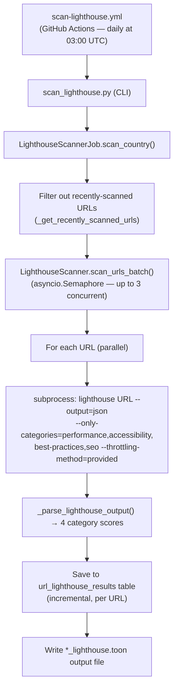

<!-- LIGHTHOUSE_STATS_START -->

_Stats as of 2026-04-25 05:52 UTC — last scan: 2026-04-24_

**1** scan batches run

**624** of **3,763** available pages audited (**16.6%** coverage)
**453** successful audits (**72.6%** of audited)

**Overall average Lighthouse scores** (0–100 scale):

| Performance | Accessibility | Best Practices | SEO |
|:-----------:|:-------------:|:--------------:|:---:|
| 86 | 89 | 66 | 90 |

---

## Lighthouse Scores by Country

| Country | Audited | Available | Perf | A11y | Best Practices | SEO | Last Scan |
|---------|--------:|----------:|:----:|:----:|:--------------:|:---:|-----------|
| Usa Edu Master | 624 | 3,763 | 86 | 89 | 66 | 90 | 2026-04-24 |

> Scores are averages across all successfully audited URLs, displayed as 0–100 (Lighthouse stores scores as 0.0–1.0 internally).

---

📥 Machine-readable results: [Download machine-readable Lighthouse data (JSON)](lighthouse-data.json) · [Download per-URL Lighthouse data (CSV)](lighthouse-data.csv)

<!-- LIGHTHOUSE_STATS_END -->

---

## Overview

The Lighthouse scanner runs the [Google Lighthouse CLI](https://github.com/GoogleChrome/lighthouse)
against each scanned page URL and extracts four headline category scores:

| Category | What it measures |
|---|---|
| **Performance** | Page speed and Core Web Vitals (LCP, FID, CLS, etc.) |
| **Accessibility** | WCAG-aligned accessibility checks (colour contrast, ARIA labels, keyboard navigation, …) |
| **Best Practices** | Security headers, HTTPS, modern web APIs, console errors |
| **SEO** | Search-engine crawlability, meta tags, structured data |

All scores are on a **0–100** scale (stored internally as 0.0–1.0).

> **Note:** PWA (Progressive Web App) audits are skipped for this project because
> they are not relevant to the EU Web Accessibility Directive requirements and omitting
> them reduces per-URL scan time.

---

## How to Interpret the Scores

Lighthouse scores are based on a single page load at the time of the audit.
Scores can vary between runs due to network conditions and server load, so the
values shown here are averages across all successfully audited URLs for each
country.

- **90–100**: Good
- **50–89**: Needs improvement
- **0–49**: Poor

For a detailed breakdown of individual audit failures, download the
[machine-readable Lighthouse data (JSON)](lighthouse-data.json) or
the [per-URL Lighthouse data (CSV)](lighthouse-data.csv).

---

## Running a Scan

### Via GitHub Actions (recommended)

1. Go to [Actions → Scan Lighthouse](https://github.com/mgifford/edu-scans/actions/workflows/scan-lighthouse.yml)
2. Click **Run workflow**
3. Optionally enter a seed code (e.g. `USA_EDU_MASTER`) or leave blank to scan all seed files
4. Optionally adjust the rate limit, concurrency, and skip-recently-scanned-days parameters

The scan runs automatically every day at 03:00 UTC.  With `--concurrency 3`
and skipping URLs audited within the last 30 days, each daily run covers
roughly 750–1,000 URLs while ensuring every URL is refreshed at least monthly.

### Via the command line

```bash
# Scan a single seed
python3 -m src.cli.scan_lighthouse --country USA_EDU_MASTER

# Scan all seed files (with a 110-minute runtime cap and 3 concurrent processes)
python3 -m src.cli.scan_lighthouse \
  --all \
  --max-runtime 110 \
  --concurrency 3 \
  --skip-recently-scanned-days 30 \
  --only-categories performance,accessibility,best-practices,seo \
  --throttling-method provided
```

---

## Architecture



---

## Related Pages

- [Lighthouse Scanning Documentation](lighthouse-scanning.md) — full technical reference
- [Scan Progress Report](scan-progress.md) — overview of all scan types
- [Accessibility Statement Scanning](accessibility-statements.md) — EU Directive compliance
