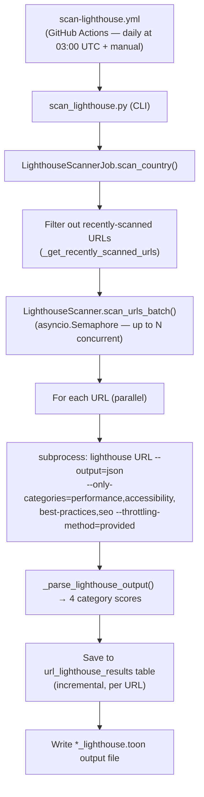

This page describes how the project runs Google Lighthouse audits on United States higher-education
institution websites to measure performance, accessibility, best practices, and SEO.

👉 **[View the latest Lighthouse results →](lighthouse-results.md)**

---

## Overview

The Lighthouse scanner runs the [Google Lighthouse CLI](https://github.com/GoogleChrome/lighthouse)
against each scanned page URL and extracts four headline category scores:

| Category | What it measures |
|---|---|
| **Performance** | Page speed and Core Web Vitals (LCP, FID, CLS, etc.) |
| **Accessibility** | WCAG-aligned accessibility checks (colour contrast, ARIA labels, keyboard navigation, …) |
| **Best Practices** | Security headers, HTTPS, modern web APIs, console errors |
| **SEO** | Search-engine crawlability, meta tags, structured data |

All scores are on a **0–100** scale (stored internally as 0.0–1.0).

> PWA (Progressive Web App) audits are skipped — they are not a current reporting priority for this project and omitting them reduces per-URL
> scan time significantly.

---

## Usage

### Prerequisites

```bash
# Install the Lighthouse CLI globally
npm install -g lighthouse

# Chromium must also be available (pre-installed on ubuntu-latest GitHub runners)
```

### Scan a single seed

```bash
python3 -m src.cli.scan_lighthouse --country USA_EDU_MASTER
```

### Scan all seed files

```bash
python3 -m src.cli.scan_lighthouse --all
```

### Scan all seed files with a runtime cap (recommended for CI)

```bash
python3 -m src.cli.scan_lighthouse \
  --all \
  --max-runtime 110 \
  --concurrency 3 \
  --skip-recently-scanned-days 30 \
  --only-categories performance,accessibility,best-practices,seo \
  --throttling-method provided
```

### Command-line options

| Option | Default | Description |
|---|---|---|
| `--country CODE` | — | Seed code to scan (e.g. `USA_EDU_MASTER`) |
| `--all` | — | Scan all seed files in the TOON directory |
| `--toon-dir PATH` | `data/toon-seeds` | Directory with `.toon` seed files |
| `--rate-limit N` | `0.2` | Minimum gap (seconds⁻¹) between starting new Lighthouse processes |
| `--concurrency N` | `1` | Maximum parallel Lighthouse processes.  `3` is a good default for CI. |
| `--skip-recently-scanned-days N` | `0` | Skip URLs successfully scanned within the last N days.  `30` for a monthly refresh. |
| `--only-categories LIST` | (all) | Comma-separated list of Lighthouse categories to run (e.g. `performance,accessibility,best-practices,seo`) |
| `--throttling-method METHOD` | (lighthouse default) | Lighthouse throttling method.  `provided` skips slow-network simulation, which is appropriate for server-to-server audits. |
| `--max-runtime N` | `0` (no limit) | Maximum runtime in minutes.  Set to ~10 minutes less than the GitHub Actions `timeout-minutes` value. |
| `--lighthouse-path PATH` | `lighthouse` | Path to the Lighthouse binary (defaults to `PATH` lookup) |

---

## GitHub Actions

The **Scan Lighthouse** workflow (`.github/workflows/scan-lighthouse.yml`) runs automatically
every day at 03:00 UTC and can also be triggered manually from the Actions tab:

1. Go to **Actions → Scan Lighthouse → Run workflow**
2. Optionally enter a seed code (leave blank to scan all seed files)
3. Optionally adjust the rate limit, concurrency, and skip-recently-scanned-days

### Why daily?

With `--concurrency 3`, `--only-categories performance,accessibility,best-practices,seo`,
and `--throttling-method provided`, each URL takes ~20–30 s.  A 110-minute run covers
~750–1,000 URLs.  Running daily with `--skip-recently-scanned-days 30` ensures every URL
is refreshed at least once per month while focusing each run on previously uncovered URLs.

Lighthouse now has **its own concurrency group** (`lighthouse-scan`) so it is never
cancelled by higher-frequency scans like social-media (every 2 hours) or tech (every 4 hours).

### Artifacts uploaded after each run

| Artifact | Contents |
|---|---|
| `lighthouse-scan-<run_number>` | `data/metadata.db`, scan output log, annotated `*_lighthouse.toon` files |
| `validation-metadata` | `data/metadata.db` (shared with URL validation, social media, and tech scans) |

---

## Output

### Annotated TOON file

Each page entry in the output `*_lighthouse.toon` file gains a `lighthouse` field:

```json
{
  "url": "https://example.gov/",
  "is_root_page": true,
  "lighthouse": {
    "performance": 0.95,
    "accessibility": 0.87,
    "best_practices": 1.0,
    "seo": 0.92,
    "pwa": 0.0
  }
}
```

If the Lighthouse audit failed for a URL, a `lighthouse_error` field is added instead:

```json
{
  "url": "https://unreachable.gov/",
  "lighthouse_error": "Lighthouse timed out after 120s"
}
```

### Database table

Results are stored in the `url_lighthouse_results` table:

| Column | Type | Description |
|---|---|---|
| `url` | TEXT | Page URL |
| `country_code` | TEXT | Legacy field name for seed identifier |
| `scan_id` | TEXT | Unique scan run ID |
| `performance_score` | REAL | Performance score (0.0–1.0), NULL if not available |
| `accessibility_score` | REAL | Accessibility score (0.0–1.0), NULL if not available |
| `best_practices_score` | REAL | Best Practices score (0.0–1.0), NULL if not available |
| `seo_score` | REAL | SEO score (0.0–1.0), NULL if not available |
| `pwa_score` | REAL | PWA score (0.0–1.0), NULL if not available |
| `error_message` | TEXT | Error message (if audit failed) |
| `scanned_at` | TEXT | ISO-8601 timestamp |

Query example:

```sql
SELECT url, accessibility_score * 100 AS accessibility
FROM url_lighthouse_results
WHERE country_code = 'USA_EDU_MASTER'
ORDER BY accessibility_score DESC;
```

---

## Architecture



---

## Notes

- **Parallelism:** Up to `--concurrency` Lighthouse processes run simultaneously, controlled
  by an `asyncio.Semaphore`.  The rate limit controls how quickly new processes are started.
- **Speed flags:** `--only-categories performance,accessibility,best-practices,seo` skips the
  PWA audit category (not currently tracked in project summaries) and `--throttling-method provided`
  skips simulated slow-network throttling.  Together they reduce per-URL time from ~60–90 s
  to ~20–30 s.
- **Skip recently scanned:** URLs successfully audited within the last N days are skipped,
  so each run focuses on previously uncovered or overdue URLs.  Seed groups not yet scanned
  are prioritised.
- Lighthouse requires **Chrome or Chromium** to be installed.  On GitHub Actions
  `ubuntu-latest` runners, Chromium is pre-installed.
- Failed Lighthouse audits do **not** remove a URL from future scans — errors are recorded
  but the URL is kept for subsequent audit cycles.
- Results are persisted **incrementally** (one URL at a time) so that partial results are
  preserved even if the GitHub Actions job times out.
- The `*_lighthouse.toon` output files are excluded from version control (see `.gitignore`).
- Lighthouse measures page quality at scan time; scores can vary between runs due to network
  conditions and server load.
