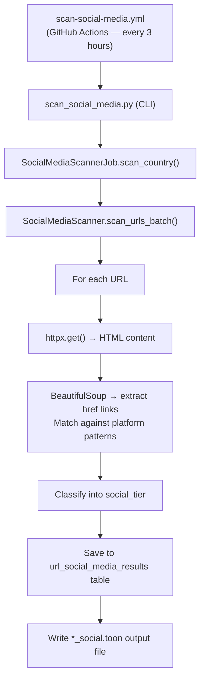

<!-- SOCIAL_MEDIA_STATS_START -->

<div id="sm-tier-pie-container" style="float:right;margin:0 0 1rem 1.5rem;width:260px;max-width:45%;">
<svg role="img" aria-labelledby="pie-title pie-desc" viewBox="0 0 240 314" width="240" height="314" xmlns="http://www.w3.org/2000/svg">
<title id="pie-title">Social media tier distribution</title>
<desc id="pie-desc">Pie chart: social media tier distribution across 3,849 scanned pages. Legacy only: 1,263 (32.8%), Modern only: 6 (0.2%), Mixed: 676 (17.6%), No Social: 939 (24.4%)</desc>
<path d="M 120,110 L 120.000,20.000 A 90,90 0 0,1 154.215,193.243 Z" fill="#1a8cd8" stroke="#fff" stroke-width="1"><title>Twitter/X only: 1,263 (43.8%)</title></path>
<path d="M 120,110 L 154.215,193.243 A 90,90 0 0,1 153.124,193.683 Z" fill="#0085ff" stroke="#fff" stroke-width="1"><title>Modern only: 6 (0.2%)</title></path>
<path d="M 120,110 L 153.124,193.683 A 90,90 0 0,1 39.961,151.156 Z" fill="#7856ff" stroke="#fff" stroke-width="1"><title>Mixed: 676 (23.4%)</title></path>
<path d="M 120,110 L 39.961,151.156 A 90,90 0 0,1 120.000,20.000 Z" fill="#cccccc" stroke="#fff" stroke-width="1"><title>No Social: 939 (32.6%)</title></path>
<rect x="20" y="216" width="14" height="14" fill="#1a8cd8"/>
<text x="40" y="227" font-size="11" font-family="sans-serif" fill="#333">Twitter/X only (43.8%)</text>
<rect x="20" y="238" width="14" height="14" fill="#0085ff"/>
<text x="40" y="249" font-size="11" font-family="sans-serif" fill="#333">Modern only (0.2%)</text>
<rect x="20" y="260" width="14" height="14" fill="#7856ff"/>
<text x="40" y="271" font-size="11" font-family="sans-serif" fill="#333">Mixed (23.4%)</text>
<rect x="20" y="282" width="14" height="14" fill="#cccccc"/>
<text x="40" y="293" font-size="11" font-family="sans-serif" fill="#333">No Social (32.6%)</text>
</svg>
<p style="text-align:center;font-size:0.75em;margin:0.3rem 0 0;color:#555;font-style:italic;">Social media tier distribution</p>
</div>

_Stats as of 2026-05-01 06:21 UTC — last scan: 2026-04-28_

**3** scan batches run

**3,755** of **3,863** available pages scanned (**97.2%** coverage)
**2,801** of **3,755** scanned pages were reachable (**74.6%**)

**Legacy social media** (older, centralised platforms):

| Platform | Pages with link | % of scanned | % of reachable |
|----------|----------------|:------------:|:--------------:|
| 🐦 Twitter | **1,045** | 27.8% | 37.3% |
| ✖ X | **297** | 7.9% | 10.6% |
| 👍 Facebook | **1,865** | 49.7% | 66.6% |
| 💼 LinkedIn | **1,250** | 33.3% | 44.6% |

**Modern / open social media** (decentralised or open platforms):

| Platform | Pages with link | % of scanned | % of reachable |
|----------|----------------|:------------:|:--------------:|
| 🦋 Bluesky | **52** | 1.4% | 1.9% |
| 🐘 Mastodon / Fediverse | **634** | 16.9% | 22.6% |

<div style="clear:both;"></div>

📥 Machine-readable results are available as the [social-media-data.json artifact (machine-readable JSON)](https://github.com/mgifford/eu-plus-government-scans/actions/workflows/generate-scan-progress.yml).

---

## Digital Sovereignty Rankings

Countries ranked by **Digital Sovereignty Score** — the percentage of reachable pages using *no social media* or *modern open platforms only* (Mastodon / Bluesky).  A higher score means fewer links to US corporate social-media platforms (Twitter / X, Facebook, LinkedIn).  Pages with no social-media links at all score highest; pages linking only to Mastodon or Bluesky also rank well.  **Legacy Exposure** shows the percentage of reachable pages that still link to Twitter/X, Facebook, or LinkedIn.

| Rank | Country | Sovereignty Score | No Social | Modern Only | Legacy Exposure | Tier |
|------|---------|:-----------------:|:---------:|:-----------:|:---------------:|------|
| 1 | Usa Edu Master | 33.0% | 917 | 6 | 67.0% | ⚠️ Legacy-heavy |
| 2 | Usa Edu Top100 | 24.7% | 22 | 0 | 75.3% | ⚠️ Legacy-heavy |

---

## Social Media Scan by Institution Group

**Available**: all pages tracked in our domain list. **Reachable**: of those scanned, pages that returned a valid HTTP response (not an error or timeout). **Sov. Score**: Digital Sovereignty Score — % of reachable pages with no social media or modern-only social presence. Tier columns classify each page by its overall social media presence; platform columns count pages with at least one link to that platform — a page may appear in more than one platform column.

| Country | Scanned | Available | Reachable | Sov. Score | No Social | Legacy-only | Twitter | X | Facebook | LinkedIn | Modern | Mixed | Bluesky | Mastodon | Scan Period |
|---------|---------|-----------|-----------|:----------:|-----------|-------------|---------|---|----------|----------|--------|-------|---------|----------|-------------|
| Usa Edu Master | 3,749 | 3,763 | 2,795 | 33.0% | 917 | 1,232 | 1,040 | 296 | 1,859 | 1,246 | 6 | 640 | 51 | 630 | Apr 2026 |
| Usa Edu Top100 | 100 | 100 | 89 | 24.7% | 22 | 31 | 41 | 19 | 67 | 53 | 0 | 36 | 9 | 33 | Apr 2026 |
| **Total** | **3,849** | **3,863** | **2,884** | **32.8%** | **939** | **1,263** | **1,081** | **315** | **1,926** | **1,299** | **6** | **676** | **60** | **663** | — |

> Hover or focus any non-zero country-table count to preview matching pages. Activate the number to keep the preview open. Full machine-readable data is available as the [social-media-data.json artifact (machine-readable JSON)](https://github.com/mgifford/eu-plus-government-scans/actions/workflows/generate-scan-progress.yml).

---

## Top 100 Universities - Social Media Presence

Social media presence for the top 100 US universities by national ranking. **Tier** shows the overall classification for each institution's homepage. **Platforms** lists which social media networks were detected. Rows with *Not yet scanned* have not been included in a scan run yet.

| Rank | Institution | Tier | Platforms |
|-----:|-------------|------|-----------|
| 1 | Massachusetts Institute of Technology | ⚠️ Legacy-only | 🐦 Twitter, 👍 Facebook |
| 2 | Stanford University | ⚠️ Legacy-only | 🐦 Twitter, 👍 Facebook, 💼 LinkedIn |
| 3 | Harvard University | 🔀 Mixed | 👍 Facebook, 💼 LinkedIn, 🐘 Mastodon |
| 4 | Princeton University | ❌ Unreachable | *(none)* |
| 5 | California Institute of Technology | 🔀 Mixed | 🐦 Twitter, 👍 Facebook, 💼 LinkedIn, 🦋 Bluesky |
| 6 | Yale University | ⚠️ Legacy-only | 👍 Facebook |
| 7 | Columbia University | ✅ No Social | *(none)* |
| 8 | The University of Chicago | ✅ No Social | *(none)* |
| 9 | University of Pennsylvania | ✅ No Social | *(none)* |
| 10 | Johns Hopkins University | ❌ Unreachable | *(none)* |
| 11 | Northwestern University | 🔀 Mixed | 🐦 Twitter, 👍 Facebook, 💼 LinkedIn, 🐘 Mastodon |
| 12 | Duke University | 🔀 Mixed | ✖ X, 👍 Facebook, 💼 LinkedIn, 🐘 Mastodon |
| 13 | Dartmouth College | ⚠️ Legacy-only | ✖ X, 👍 Facebook |
| 14 | Brown University | ⚠️ Legacy-only | 🐦 Twitter, 👍 Facebook, 💼 LinkedIn |
| 15 | Vanderbilt University | 🔀 Mixed | 🐦 Twitter, 👍 Facebook, 💼 LinkedIn, 🐘 Mastodon |
| 16 | Rice University | ❌ Unreachable | *(none)* |
| 17 | University of Notre Dame | ❌ Unreachable | *(none)* |
| 18 | University of California Los Angeles | 🔀 Mixed | 🐦 Twitter, 👍 Facebook, 💼 LinkedIn, 🐘 Mastodon |
| 19 | Georgetown University | ✅ No Social | *(none)* |
| 20 | Emory University | 🔀 Mixed | 🐦 Twitter, 👍 Facebook, 💼 LinkedIn, 🐘 Mastodon |
| 21 | University of California Berkeley | ✅ No Social | *(none)* |
| 22 | Carnegie Mellon University | 🔀 Mixed | ✖ X, 👍 Facebook, 💼 LinkedIn, 🦋 Bluesky, 🐘 Mastodon |
| 23 | University of California San Diego | 🔀 Mixed | 🐦 Twitter, 👍 Facebook, 💼 LinkedIn, 🦋 Bluesky, 🐘 Mastodon |
| 24 | Tufts University | ✅ No Social | *(none)* |
| 25 | University of Florida | ❌ Unreachable | *(none)* |
| 26 | University of North Carolina at Chapel Hill | ✅ No Social | *(none)* |
| 27 | University of Rochester | 🔀 Mixed | 🐦 Twitter, 👍 Facebook, 💼 LinkedIn, 🐘 Mastodon |
| 28 | Boston College | 🔀 Mixed | 🐦 Twitter, 👍 Facebook, 💼 LinkedIn, 🦋 Bluesky, 🐘 Mastodon |
| 29 | Case Western Reserve University | ✅ No Social | *(none)* |
| 30 | Georgia Institute of Technology | ⚠️ Legacy-only | ✖ X, 👍 Facebook, 💼 LinkedIn |
| 31 | Wake Forest University | ❌ Unreachable | *(none)* |
| 32 | New York University | ✅ No Social | *(none)* |
| 33 | Tulane University | ✅ No Social | *(none)* |
| 34 | University of Southern California | ✅ No Social | *(none)* |
| 35 | Boston University | 🔀 Mixed | 🐦 Twitter, 👍 Facebook, 💼 LinkedIn, 🐘 Mastodon |
| 36 | Ohio State University | ❌ Unreachable | *(none)* |
| 37 | Lehigh University | 🔀 Mixed | 👍 Facebook, 💼 LinkedIn, 🐘 Mastodon |
| 38 | Pennsylvania State University | 🔀 Mixed | 👍 Facebook, 💼 LinkedIn, 🐘 Mastodon |
| 39 | Purdue University | ⚠️ Legacy-only | 🐦 Twitter, 👍 Facebook, 💼 LinkedIn |
| 40 | University of Virginia | ❌ Unreachable | *(none)* |
| 41 | University of Michigan | ✅ No Social | *(none)* |
| 42 | Florida State University | ⚠️ Legacy-only | ✖ X, 👍 Facebook, 💼 LinkedIn |
| 43 | University of Georgia | ✅ No Social | *(none)* |
| 44 | University of Texas at Austin | ✅ No Social | *(none)* |
| 45 | University of Wisconsin Madison | 🔀 Mixed | ✖ X, 👍 Facebook, 💼 LinkedIn, 🦋 Bluesky |
| 46 | University of Illinois Urbana-Champaign | ⚠️ Legacy-only | 🐦 Twitter, 👍 Facebook, 💼 LinkedIn |
| 47 | University of California Irvine | ⚠️ Legacy-only | 🐦 Twitter, 👍 Facebook, 💼 LinkedIn |
| 48 | Indiana University Bloomington | ⚠️ Legacy-only | 🐦 Twitter, 👍 Facebook, 💼 LinkedIn |
| 49 | Brandeis University | 🔀 Mixed | 👍 Facebook, 💼 LinkedIn, 🦋 Bluesky, 🐘 Mastodon |
| 50 | University of California Davis | ✅ No Social | *(none)* |
| 51 | Rutgers The State University of New Jersey | ⚠️ Legacy-only | 🐦 Twitter, ✖ X, 👍 Facebook, 💼 LinkedIn |
| 52 | College of William and Mary | 🔀 Mixed | 👍 Facebook, 💼 LinkedIn, 🐘 Mastodon |
| 53 | University of Maryland College Park | 🔀 Mixed | ✖ X, 👍 Facebook, 🐘 Mastodon |
| 54 | University of Pittsburgh | 🔀 Mixed | 👍 Facebook, 💼 LinkedIn, 🐘 Mastodon |
| 55 | University of Minnesota Twin Cities | 🔀 Mixed | 🐦 Twitter, 👍 Facebook, 💼 LinkedIn, 🐘 Mastodon |
| 56 | Michigan State University | 🔀 Mixed | 🐦 Twitter, 👍 Facebook, 💼 LinkedIn, 🐘 Mastodon |
| 57 | Arizona State University | ⚠️ Legacy-only | 👍 Facebook, 💼 LinkedIn |
| 58 | University of Colorado Boulder | 🔀 Mixed | ✖ X, 👍 Facebook, 💼 LinkedIn, 🦋 Bluesky |
| 59 | University of Utah | ⚠️ Legacy-only | ✖ X, 👍 Facebook |
| 60 | University of Connecticut | 🔀 Mixed | 🐦 Twitter, 👍 Facebook, 💼 LinkedIn, 🐘 Mastodon |
| 61 | George Washington University | ❌ Unreachable | *(none)* |
| 62 | American University | ✅ No Social | *(none)* |
| 63 | Northeastern University | 🔀 Mixed | 🐦 Twitter, 👍 Facebook, 💼 LinkedIn, 🐘 Mastodon |
| 64 | George Mason University | 🔀 Mixed | 🐦 Twitter, 👍 Facebook, 💼 LinkedIn, 🦋 Bluesky, 🐘 Mastodon |
| 65 | Fordham University | ⚠️ Legacy-only | 🐦 Twitter, 👍 Facebook, 💼 LinkedIn |
| 66 | Texas A&M University | ⚠️ Legacy-only | 🐦 Twitter, 👍 Facebook, 💼 LinkedIn |
| 67 | University of Kansas | ⚠️ Legacy-only | 👍 Facebook |
| 68 | Oregon State University | 🔀 Mixed | 🐦 Twitter, 👍 Facebook, 🐘 Mastodon |
| 69 | Colorado State University | ❌ Unreachable | *(none)* |
| 70 | Virginia Tech | 🔀 Mixed | ✖ X, 👍 Facebook, 💼 LinkedIn, 🦋 Bluesky, 🐘 Mastodon |
| 71 | University of Iowa | ⚠️ Legacy-only | 🐦 Twitter, 👍 Facebook, 💼 LinkedIn |
| 72 | Iowa State University | 🔀 Mixed | 🐦 Twitter, ✖ X, 👍 Facebook, 🐘 Mastodon |
| 73 | University of Nebraska Lincoln | ⚠️ Legacy-only | ✖ X, 👍 Facebook, 💼 LinkedIn |
| 74 | University of Arkansas | ⚠️ Legacy-only | 🐦 Twitter, 👍 Facebook, 💼 LinkedIn |
| 75 | Stony Brook University | ⚠️ Legacy-only | 🐦 Twitter, 👍 Facebook, 💼 LinkedIn |
| 76 | University of Arizona | ⚠️ Legacy-only | ✖ X, 👍 Facebook, 💼 LinkedIn |
| 77 | University of Alabama | ✅ No Social | *(none)* |
| 78 | Louisiana State University | 🔀 Mixed | 🐦 Twitter, 👍 Facebook, 💼 LinkedIn, 🐘 Mastodon |
| 79 | University of Kentucky | 🔀 Mixed | 🐦 Twitter, 👍 Facebook, 🐘 Mastodon |
| 80 | University of Tennessee | ✅ No Social | *(none)* |
| 81 | University of Missouri | ⚠️ Legacy-only | ✖ X, 👍 Facebook |
| 82 | Kansas State University | ⚠️ Legacy-only | 🐦 Twitter, 👍 Facebook |
| 83 | University of Mississippi | ⚠️ Legacy-only | 🐦 Twitter, 👍 Facebook, 💼 LinkedIn |
| 84 | University of Oregon | ✅ No Social | *(none)* |
| 85 | University of Nevada Las Vegas | ✅ No Social | *(none)* |
| 86 | Baylor University | ⚠️ Legacy-only | 🐦 Twitter, ✖ X, 👍 Facebook, 💼 LinkedIn |
| 87 | Southern Methodist University | ⚠️ Legacy-only | 🐦 Twitter, 👍 Facebook, 💼 LinkedIn |
| 88 | University of Miami | ⚠️ Legacy-only | 🐦 Twitter, 👍 Facebook |
| 89 | Villanova University | ✅ No Social | *(none)* |
| 90 | St. John's University | 🔀 Mixed | 🐦 Twitter, 👍 Facebook, 💼 LinkedIn, 🐘 Mastodon |
| 91 | Marquette University | 🔀 Mixed | ✖ X, 👍 Facebook, 💼 LinkedIn, 🐘 Mastodon |
| 92 | Santa Clara University | 🔀 Mixed | 🐦 Twitter, 👍 Facebook, 💼 LinkedIn, 🐘 Mastodon |
| 93 | University of Denver | ✅ No Social | *(none)* |
| 94 | Texas Christian University | 🔀 Mixed | ✖ X, 👍 Facebook, 💼 LinkedIn, 🐘 Mastodon |
| 95 | Drexel University | 🔀 Mixed | 👍 Facebook, 💼 LinkedIn, 🐘 Mastodon |
| 96 | Howard University | ⚠️ Legacy-only | 🐦 Twitter, 👍 Facebook |
| 97 | Clark Atlanta University | ❌ Unreachable | *(none)* |
| 98 | Xavier University of Louisiana | ⚠️ Legacy-only | 🐦 Twitter, 👍 Facebook |
| 99 | Spelman College | ⚠️ Legacy-only | ✖ X, 👍 Facebook, 💼 LinkedIn |
| 100 | Morehouse College | 🔀 Mixed | 🐦 Twitter, 👍 Facebook, 💼 LinkedIn, 🐘 Mastodon |

*100 of 100 ranked institutions scanned so far.*

<!-- SOCIAL_MEDIA_STATS_END -->

---

## Overview

The social media scanner fetches each institution page and inspects the HTML for
links to known social platforms. Results are stored in the metadata database
and published to this site via the [Scan Progress Report](scan-progress.md).

Scans run **automatically every 3 hours** via GitHub Actions so that the full
tracked URLs can be covered gradually without
overloading institutional servers.

---

## Platforms Tracked

### Legacy Social Media (older, centralised platforms)

| Platform | Domains detected |
|----------|-----------------|
| **Twitter** | `twitter.com` |
| **X** | `x.com` |
| **Facebook** | `facebook.com`, `fb.com` |
| **LinkedIn** | `linkedin.com` |

### Modern / Open Social Media (decentralised or open platforms)

| Platform | Domains detected |
|----------|-----------------|
| **Bluesky** | `bsky.app`, `bsky.social` |
| **Mastodon / Fediverse** | 40+ known instances + `/@username` pattern detection |

---

## Tier Classification

Each scanned page is assigned one of five tiers:

| Tier | Meaning |
|------|---------|
| `unreachable` | Page could not be fetched (network error, timeout, 4xx/5xx) |
| `no_social` | Page is reachable but contains no recognised social media links |
| `twitter_only` | Page links only to legacy platforms (Twitter, X, Facebook, or LinkedIn) |
| `modern_only` | Page links only to Bluesky or Mastodon (modern / open platforms) |
| `mixed` | Page links to at least one legacy platform **and** at least one modern platform |

---

## Viewing Results

### Scan Progress Report

The **[Scan Progress Report](scan-progress.md)** is regenerated after every
scan and shows per-seed breakdowns including:

- Total URLs scanned and reachable count
- Tier distribution (twitter-only / modern / mixed / no-social / unreachable)
- Per-platform link counts (Twitter, X, Bluesky, Mastodon)
- Date range showing when each seed was last scanned

### GitHub Actions Artifacts

Each workflow run also uploads a scan artifact containing:

- `data/metadata.db` — the full SQLite results database
- `social-scan-output.txt` — the raw scan log
- `data/toon-seeds/**_social.toon` — annotated TOON files

To download artifacts:

1. Go to [GitHub Actions → Scan Social Media Links](https://github.com/mgifford/edu-scans/actions/workflows/scan-social-media.yml)
2. Click on the relevant workflow run
3. Scroll to the **Artifacts** section at the bottom of the run summary page
4. Download `social-scan-<run_number>` to inspect the database or TOON files

---

## Seed Groups

The scanner uses TOON seed files to organise which institutions to scan.
Multiple seed files are supported — each appears as a separate row in the
**Social Media Scan by Institution Group** table and the **Digital Sovereignty
Rankings** leaderboard.

| Seed file | Country code | Contents |
|-----------|-------------|----------|
| `usa-edu-master.toon` | `USA_EDU_MASTER` | All 3,700+ US `.edu` institutions |
| `usa-edu-top100.toon` | `USA_EDU_TOP100` | Top 100 universities by national ranking |

### Top 100 Universities Seed

`data/toon-seeds/usa-edu-top100.toon` is generated from
`data/rankings/us-news-top100.csv` using:

```bash
python3 scripts/build_top100_toon.py
```

Each domain entry in the Top 100 TOON carries a `ranking` field.  When scan
results exist for these URLs, the report adds a per-institution table showing
each university's social media tier ranked in order.

### Per-State Seeds (optional)

The `scripts/split_toon_by_state.py` script can split the master TOON into
one file per US state for state-level comparison:

```bash
# Preview what would be generated (no files written)
python3 scripts/split_toon_by_state.py --dry-run

# Generate all per-state TOON files
python3 scripts/split_toon_by_state.py
```

> **Note:** State assignment currently uses institution-name pattern matching,
> which resolves approximately 36% of institutions.  For full coverage, provide
> an IPEDS `HD202x.csv` file from the
> [NCES data portal](https://nces.ed.gov/ipeds/use-the-data/download-access-database)
> and match against `WEBADDR` / `STABBR` fields.

---

## Running a Scan Manually

### Via GitHub Actions (recommended)

1. Go to [Actions → Scan Social Media Links](https://github.com/mgifford/edu-scans/actions/workflows/scan-social-media.yml)
2. Click **Run workflow**
3. Optionally enter a seed code (e.g. `USA_EDU_MASTER` or `USA_EDU_TOP100`) or leave blank to scan all seed files
4. Optionally adjust the rate limit (default: 1.0 req/sec)

### Via the command line

```bash
# Scan the full master seed
python3 -m src.cli.scan_social_media --country USA_EDU_MASTER --rate-limit 1.0

# Scan only the Top 100 universities
python3 -m src.cli.scan_social_media --country USA_EDU_TOP100 --rate-limit 1.0

# Scan all seed files (with a 110-minute runtime cap)
python3 -m src.cli.scan_social_media --all --max-runtime 110 --rate-limit 1.0
```

---

## Output Format

### Annotated TOON file (`*_social.toon`)

Each page entry gains a `social_media` field:

```json
{
  "url": "https://example.gov/",
  "is_root_page": true,
  "social_media": {
    "is_reachable": true,
    "social_tier": "mixed",
    "twitter_links": ["https://twitter.com/example_gov"],
    "x_links": [],
    "facebook_links": [],
    "linkedin_links": [],
    "bluesky_links": ["https://bsky.app/profile/example.bsky.social"],
    "mastodon_links": []
  }
}
```

### Database table (`url_social_media_results`)

| Column | Type | Description |
|--------|------|-------------|
| `url` | TEXT | Page URL |
| `country_code` | TEXT | Legacy field name for seed identifier (e.g. `USA_EDU_MASTER`) |
| `scan_id` | TEXT | Unique scan run identifier |
| `is_reachable` | INTEGER | 1 = reachable, 0 = not reachable |
| `twitter_links` | TEXT | JSON list of `twitter.com` hrefs found |
| `x_links` | TEXT | JSON list of `x.com` hrefs found |
| `facebook_links` | TEXT | JSON list of `facebook.com` / `fb.com` hrefs found |
| `linkedin_links` | TEXT | JSON list of `linkedin.com` hrefs found |
| `bluesky_links` | TEXT | JSON list of Bluesky hrefs found |
| `mastodon_links` | TEXT | JSON list of Mastodon hrefs found |
| `social_tier` | TEXT | Tier classification (see above) |
| `scanned_at` | TEXT | ISO-8601 timestamp of scan |

---

## Coverage Scope

Scans currently target United States higher-education institutions in the
seed set.

See also the **[Institution Domains](domains.md)** page for a full listing of
all tracked domains.

---

## Architecture


