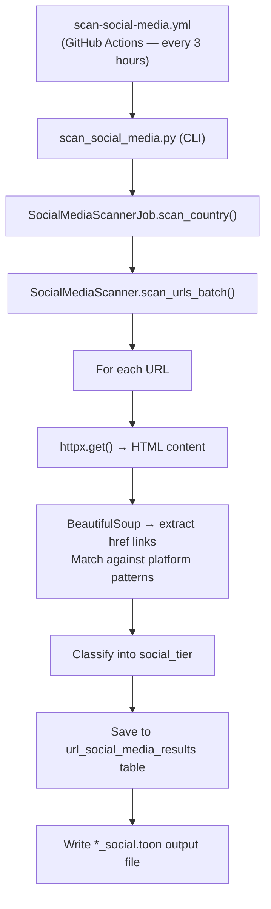

<!-- SOCIAL_MEDIA_STATS_START -->

<div id="sm-tier-pie-container" style="float:right;margin:0 0 1rem 1.5rem;width:260px;max-width:45%;">
<svg role="img" aria-labelledby="pie-title pie-desc" viewBox="0 0 240 314" width="240" height="314" xmlns="http://www.w3.org/2000/svg">
<title id="pie-title">Social media tier distribution</title>
<desc id="pie-desc">Pie chart: social media tier distribution across 3,085 scanned pages. Legacy only: 938 (30.4%), Modern only: 7 (0.2%), Mixed: 502 (16.3%), No Social: 837 (27.1%)</desc>
<path d="M 120,110 L 120.000,20.000 A 90,90 0 0,1 167.898,186.196 Z" fill="#1a8cd8" stroke="#fff" stroke-width="1"><title>Twitter/X only: 938 (41.1%)</title></path>
<path d="M 120,110 L 167.898,186.196 A 90,90 0 0,1 166.422,187.104 Z" fill="#0085ff" stroke="#fff" stroke-width="1"><title>Modern only: 7 (0.3%)</title></path>
<path d="M 120,110 L 166.422,187.104 A 90,90 0 0,1 53.040,170.136 Z" fill="#7856ff" stroke="#fff" stroke-width="1"><title>Mixed: 502 (22.0%)</title></path>
<path d="M 120,110 L 53.040,170.136 A 90,90 0 0,1 120.000,20.000 Z" fill="#cccccc" stroke="#fff" stroke-width="1"><title>No Social: 837 (36.6%)</title></path>
<rect x="20" y="216" width="14" height="14" fill="#1a8cd8"/>
<text x="40" y="227" font-size="11" font-family="sans-serif" fill="#333">Twitter/X only (41.1%)</text>
<rect x="20" y="238" width="14" height="14" fill="#0085ff"/>
<text x="40" y="249" font-size="11" font-family="sans-serif" fill="#333">Modern only (0.3%)</text>
<rect x="20" y="260" width="14" height="14" fill="#7856ff"/>
<text x="40" y="271" font-size="11" font-family="sans-serif" fill="#333">Mixed (22.0%)</text>
<rect x="20" y="282" width="14" height="14" fill="#cccccc"/>
<text x="40" y="293" font-size="11" font-family="sans-serif" fill="#333">No Social (36.6%)</text>
</svg>
<p style="text-align:center;font-size:0.75em;margin:0.3rem 0 0;color:#555;font-style:italic;">Social media tier distribution</p>
</div>

_Stats as of 2026-07-20 06:22 UTC — last scan: 2026-07-20_

**1** scan batches run

**3,085** of **20,362** available pages scanned (**15.2%** coverage)
**2,284** of **3,085** scanned pages were reachable (**74.0%**)

**Legacy social media** (older, centralised platforms):

| Platform | Pages with link | % of scanned | % of reachable |
|----------|----------------|:------------:|:--------------:|
| 🐦 Twitter | **771** | 25.0% | 33.8% |
| ✖ X | **241** | 7.8% | 10.6% |
| 👍 Facebook | **1,432** | 46.4% | 62.7% |
| 💼 LinkedIn | **963** | 31.2% | 42.2% |

**Modern / open social media** (decentralised or open platforms):

| Platform | Pages with link | % of scanned | % of reachable |
|----------|----------------|:------------:|:--------------:|
| 🦋 Bluesky | **29** | 0.9% | 1.3% |
| 🐘 Mastodon / Fediverse | **500** | 16.2% | 21.9% |

<div style="clear:both;"></div>

📥 Machine-readable results are available as the [social-media-data.json artifact (machine-readable JSON)](https://github.com/mgifford/edu-scans/actions/workflows/generate-scan-progress.yml).

---

## Digital Sovereignty Rankings

Countries ranked by **Digital Sovereignty Score** — the percentage of reachable pages using *no social media* or *modern open platforms only* (Mastodon / Bluesky).  A higher score means fewer links to US corporate social-media platforms (Twitter / X, Facebook, LinkedIn).  Pages with no social-media links at all score highest; pages linking only to Mastodon or Bluesky also rank well.  **Legacy Exposure** shows the percentage of reachable pages that still link to Twitter/X, Facebook, or LinkedIn.

| Rank | Country | Sovereignty Score | No Social | Modern Only | Legacy Exposure | Tier |
|------|---------|:-----------------:|:---------:|:-----------:|:---------------:|------|
| 1 | Usa Edu Master | 37.0% | 837 | 7 | 63.0% | ⚠️ Legacy-heavy |

---

## Social Media Scan by Institution Group

**Available**: all pages tracked in our domain list. **Reachable**: of those scanned, pages that returned a valid HTTP response (not an error or timeout). **Sov. Score**: Digital Sovereignty Score — % of reachable pages with no social media or modern-only social presence. Tier columns classify each page by its overall social media presence; platform columns count pages with at least one link to that platform — a page may appear in more than one platform column.

| Country | Scanned | Available | Reachable | Sov. Score | No Social | Legacy-only | Twitter | X | Facebook | LinkedIn | Modern | Mixed | Bluesky | Mastodon | Scan Period |
|---------|---------|-----------|-----------|:----------:|-----------|-------------|---------|---|----------|----------|--------|-------|---------|----------|-------------|
| Usa Edu Master | 3,085 | 3,763 | 2,284 | 37.0% | 837 | 938 | 771 | 241 | 1,432 | 963 | 7 | 502 | 29 | 500 | Jul 2026 |
| **Total** | **3,085** | **20,362** | **2,284** | **37.0%** | **837** | **938** | **771** | **241** | **1,432** | **963** | **7** | **502** | **29** | **500** | — |

> Hover or focus any non-zero country-table count to preview matching pages. Activate the number to keep the preview open. Full machine-readable data is available as the [social-media-data.json artifact (machine-readable JSON)](https://github.com/mgifford/edu-scans/actions/workflows/generate-scan-progress.yml).

---

## Top 100 Universities - Social Media Presence

Social media presence for the top 100 US universities by national ranking. **Tier** shows the overall classification for each institution's homepage. **Platforms** lists which social media networks were detected. Rows with *Not yet scanned* have not been included in a scan run yet.

| Rank | Institution | Tier | Platforms |
|-----:|-------------|------|-----------|
| 1 | Massachusetts Institute of Technology | *Not yet scanned* | — |
| 2 | Stanford University | *Not yet scanned* | — |
| 3 | Harvard University | *Not yet scanned* | — |
| 4 | Princeton University | *Not yet scanned* | — |
| 5 | California Institute of Technology | *Not yet scanned* | — |
| 6 | Yale University | *Not yet scanned* | — |
| 7 | Columbia University | *Not yet scanned* | — |
| 8 | The University of Chicago | *Not yet scanned* | — |
| 9 | University of Pennsylvania | *Not yet scanned* | — |
| 10 | Johns Hopkins University | *Not yet scanned* | — |
| 11 | Northwestern University | *Not yet scanned* | — |
| 12 | Duke University | *Not yet scanned* | — |
| 13 | Dartmouth College | *Not yet scanned* | — |
| 14 | Brown University | *Not yet scanned* | — |
| 15 | Vanderbilt University | *Not yet scanned* | — |
| 16 | Rice University | *Not yet scanned* | — |
| 17 | University of Notre Dame | *Not yet scanned* | — |
| 18 | University of California Los Angeles | *Not yet scanned* | — |
| 19 | Georgetown University | *Not yet scanned* | — |
| 20 | Emory University | *Not yet scanned* | — |
| 21 | University of California Berkeley | *Not yet scanned* | — |
| 22 | Carnegie Mellon University | *Not yet scanned* | — |
| 23 | University of California San Diego | *Not yet scanned* | — |
| 24 | Tufts University | *Not yet scanned* | — |
| 25 | University of Florida | *Not yet scanned* | — |
| 26 | University of North Carolina at Chapel Hill | *Not yet scanned* | — |
| 27 | University of Rochester | *Not yet scanned* | — |
| 28 | Boston College | *Not yet scanned* | — |
| 29 | Case Western Reserve University | *Not yet scanned* | — |
| 30 | Georgia Institute of Technology | *Not yet scanned* | — |
| 31 | Wake Forest University | *Not yet scanned* | — |
| 32 | New York University | *Not yet scanned* | — |
| 33 | Tulane University | *Not yet scanned* | — |
| 34 | University of Southern California | *Not yet scanned* | — |
| 35 | Boston University | *Not yet scanned* | — |
| 36 | Ohio State University | *Not yet scanned* | — |
| 37 | Lehigh University | *Not yet scanned* | — |
| 38 | Pennsylvania State University | *Not yet scanned* | — |
| 39 | Purdue University | *Not yet scanned* | — |
| 40 | University of Virginia | *Not yet scanned* | — |
| 41 | University of Michigan | *Not yet scanned* | — |
| 42 | Florida State University | *Not yet scanned* | — |
| 43 | University of Georgia | *Not yet scanned* | — |
| 44 | University of Texas at Austin | *Not yet scanned* | — |
| 45 | University of Wisconsin Madison | *Not yet scanned* | — |
| 46 | University of Illinois Urbana-Champaign | *Not yet scanned* | — |
| 47 | University of California Irvine | *Not yet scanned* | — |
| 48 | Indiana University Bloomington | *Not yet scanned* | — |
| 49 | Brandeis University | *Not yet scanned* | — |
| 50 | University of California Davis | *Not yet scanned* | — |
| 51 | Rutgers The State University of New Jersey | *Not yet scanned* | — |
| 52 | College of William and Mary | *Not yet scanned* | — |
| 53 | University of Maryland College Park | *Not yet scanned* | — |
| 54 | University of Pittsburgh | *Not yet scanned* | — |
| 55 | University of Minnesota Twin Cities | *Not yet scanned* | — |
| 56 | Michigan State University | *Not yet scanned* | — |
| 57 | Arizona State University | *Not yet scanned* | — |
| 58 | University of Colorado Boulder | *Not yet scanned* | — |
| 59 | University of Utah | *Not yet scanned* | — |
| 60 | University of Connecticut | *Not yet scanned* | — |
| 61 | George Washington University | *Not yet scanned* | — |
| 62 | American University | *Not yet scanned* | — |
| 63 | Northeastern University | *Not yet scanned* | — |
| 64 | George Mason University | *Not yet scanned* | — |
| 65 | Fordham University | *Not yet scanned* | — |
| 66 | Texas A&M University | *Not yet scanned* | — |
| 67 | University of Kansas | *Not yet scanned* | — |
| 68 | Oregon State University | *Not yet scanned* | — |
| 69 | Colorado State University | *Not yet scanned* | — |
| 70 | Virginia Tech | *Not yet scanned* | — |
| 71 | University of Iowa | *Not yet scanned* | — |
| 72 | Iowa State University | *Not yet scanned* | — |
| 73 | University of Nebraska Lincoln | *Not yet scanned* | — |
| 74 | University of Arkansas | *Not yet scanned* | — |
| 75 | Stony Brook University | *Not yet scanned* | — |
| 76 | University of Arizona | *Not yet scanned* | — |
| 77 | University of Alabama | *Not yet scanned* | — |
| 78 | Louisiana State University | *Not yet scanned* | — |
| 79 | University of Kentucky | *Not yet scanned* | — |
| 80 | University of Tennessee | *Not yet scanned* | — |
| 81 | University of Missouri | *Not yet scanned* | — |
| 82 | Kansas State University | *Not yet scanned* | — |
| 83 | University of Mississippi | *Not yet scanned* | — |
| 84 | University of Oregon | *Not yet scanned* | — |
| 85 | University of Nevada Las Vegas | *Not yet scanned* | — |
| 86 | Baylor University | *Not yet scanned* | — |
| 87 | Southern Methodist University | *Not yet scanned* | — |
| 88 | University of Miami | *Not yet scanned* | — |
| 89 | Villanova University | *Not yet scanned* | — |
| 90 | St. John's University | *Not yet scanned* | — |
| 91 | Marquette University | *Not yet scanned* | — |
| 92 | Santa Clara University | *Not yet scanned* | — |
| 93 | University of Denver | *Not yet scanned* | — |
| 94 | Texas Christian University | *Not yet scanned* | — |
| 95 | Drexel University | *Not yet scanned* | — |
| 96 | Howard University | *Not yet scanned* | — |
| 97 | Clark Atlanta University | *Not yet scanned* | — |
| 98 | Xavier University of Louisiana | *Not yet scanned* | — |
| 99 | Spelman College | *Not yet scanned* | — |
| 100 | Morehouse College | *Not yet scanned* | — |

*0 of 100 ranked institutions scanned so far.*

<!-- SOCIAL_MEDIA_STATS_END -->

---

## Overview

The social media scanner fetches each institution page and inspects the HTML for
links to known social platforms. Results are stored in the metadata database
and published to this site via the [Scan Progress Report](scan-progress.md).

Scans run **automatically every 3 hours** via GitHub Actions so that the full
tracked URLs can be covered gradually without
overloading institutional servers.

---

## Platforms Tracked

### Legacy Social Media (older, centralised platforms)

| Platform | Domains detected |
|----------|-----------------|
| **Twitter** | `twitter.com` |
| **X** | `x.com` |
| **Facebook** | `facebook.com`, `fb.com` |
| **LinkedIn** | `linkedin.com` |

### Modern / Open Social Media (decentralised or open platforms)

| Platform | Domains detected |
|----------|-----------------|
| **Bluesky** | `bsky.app`, `bsky.social` |
| **Mastodon / Fediverse** | 40+ known instances + `/@username` pattern detection |

---

## Tier Classification

Each scanned page is assigned one of five tiers:

| Tier | Meaning |
|------|---------|
| `unreachable` | Page could not be fetched (network error, timeout, 4xx/5xx) |
| `no_social` | Page is reachable but contains no recognised social media links |
| `twitter_only` | Page links only to legacy platforms (Twitter, X, Facebook, or LinkedIn) |
| `modern_only` | Page links only to Bluesky or Mastodon (modern / open platforms) |
| `mixed` | Page links to at least one legacy platform **and** at least one modern platform |

---

## Viewing Results

### Scan Progress Report

The **[Scan Progress Report](scan-progress.md)** is regenerated after every
scan and shows per-seed breakdowns including:

- Total URLs scanned and reachable count
- Tier distribution (twitter-only / modern / mixed / no-social / unreachable)
- Per-platform link counts (Twitter, X, Bluesky, Mastodon)
- Date range showing when each seed was last scanned

### GitHub Actions Artifacts

Each workflow run also uploads a scan artifact containing:

- `data/metadata.db` — the full SQLite results database
- `social-scan-output.txt` — the raw scan log
- `data/toon-seeds/**_social.toon` — annotated TOON files

To download artifacts:

1. Go to [GitHub Actions → Scan Social Media Links](https://github.com/mgifford/edu-scans/actions/workflows/scan-social-media.yml)
2. Click on the relevant workflow run
3. Scroll to the **Artifacts** section at the bottom of the run summary page
4. Download `social-scan-<run_number>` to inspect the database or TOON files

---

## Seed Groups

The scanner uses TOON seed files to organise which institutions to scan.
Multiple seed files are supported — each appears as a separate row in the
**Social Media Scan by Institution Group** table and the **Digital Sovereignty
Rankings** leaderboard.

| Seed file | Country code | Contents |
|-----------|-------------|----------|
| `usa-edu-master.toon` | `USA_EDU_MASTER` | All 3,700+ US `.edu` institutions |
| `usa-edu-top100.toon` | `USA_EDU_TOP100` | Top 100 universities by national ranking |

### Top 100 Universities Seed

`data/toon-seeds/usa-edu-top100.toon` is generated from
`data/rankings/us-news-top100.csv` using:

```bash
python3 scripts/build_top100_toon.py
```

Each domain entry in the Top 100 TOON carries a `ranking` field.  When scan
results exist for these URLs, the report adds a per-institution table showing
each university's social media tier ranked in order.

### Per-State Seeds (optional)

The `scripts/split_toon_by_state.py` script can split the master TOON into
one file per US state for state-level comparison:

```bash
# Preview what would be generated (no files written)
python3 scripts/split_toon_by_state.py --dry-run

# Generate all per-state TOON files
python3 scripts/split_toon_by_state.py
```

> **Note:** State assignment currently uses institution-name pattern matching,
> which resolves approximately 36% of institutions.  For full coverage, provide
> an IPEDS `HD202x.csv` file from the
> [NCES data portal](https://nces.ed.gov/ipeds/use-the-data/download-access-database)
> and match against `WEBADDR` / `STABBR` fields.

---

## Running a Scan Manually

### Via GitHub Actions (recommended)

1. Go to [Actions → Scan Social Media Links](https://github.com/mgifford/edu-scans/actions/workflows/scan-social-media.yml)
2. Click **Run workflow**
3. Optionally enter a seed code (e.g. `USA_EDU_MASTER` or `USA_EDU_TOP100`) or leave blank to scan all seed files
4. Optionally adjust the rate limit (default: 1.0 req/sec)

### Via the command line

```bash
# Scan the full master seed
python3 -m src.cli.scan_social_media --country USA_EDU_MASTER --rate-limit 1.0

# Scan only the Top 100 universities
python3 -m src.cli.scan_social_media --country USA_EDU_TOP100 --rate-limit 1.0

# Scan all seed files (with a 110-minute runtime cap)
python3 -m src.cli.scan_social_media --all --max-runtime 110 --rate-limit 1.0
```

---

## Output Format

### Annotated TOON file (`*_social.toon`)

Each page entry gains a `social_media` field:

```json
{
  "url": "https://example.gov/",
  "is_root_page": true,
  "social_media": {
    "is_reachable": true,
    "social_tier": "mixed",
    "twitter_links": ["https://twitter.com/example_gov"],
    "x_links": [],
    "facebook_links": [],
    "linkedin_links": [],
    "bluesky_links": ["https://bsky.app/profile/example.bsky.social"],
    "mastodon_links": []
  }
}
```

### Database table (`url_social_media_results`)

| Column | Type | Description |
|--------|------|-------------|
| `url` | TEXT | Page URL |
| `country_code` | TEXT | Legacy field name for seed identifier (e.g. `USA_EDU_MASTER`) |
| `scan_id` | TEXT | Unique scan run identifier |
| `is_reachable` | INTEGER | 1 = reachable, 0 = not reachable |
| `twitter_links` | TEXT | JSON list of `twitter.com` hrefs found |
| `x_links` | TEXT | JSON list of `x.com` hrefs found |
| `facebook_links` | TEXT | JSON list of `facebook.com` / `fb.com` hrefs found |
| `linkedin_links` | TEXT | JSON list of `linkedin.com` hrefs found |
| `bluesky_links` | TEXT | JSON list of Bluesky hrefs found |
| `mastodon_links` | TEXT | JSON list of Mastodon hrefs found |
| `social_tier` | TEXT | Tier classification (see above) |
| `scanned_at` | TEXT | ISO-8601 timestamp of scan |

---

## Coverage Scope

Scans currently target United States higher-education institutions in the
seed set.

See also the **[Institution Domains](domains.md)** page for a full listing of
all tracked domains.

---

## Architecture


```mermaid
flowchart TD
    A["scan-social-media.yml\n(GitHub Actions — every 3 hours)"]
    A --> B["scan_social_media.py (CLI)"]
    B --> C["SocialMediaScannerJob.scan_country()"]
    C --> D["SocialMediaScanner.scan_urls_batch()"]
    D --> E["For each URL"]
    E --> F["httpx.get() → HTML content"]
    F --> G["BeautifulSoup → extract href links\nMatch against platform patterns"]
    G --> H["Classify into social_tier"]
    H --> I["Save to url_social_media_results table"]
    I --> J["Write *_social.toon output file"]
```
