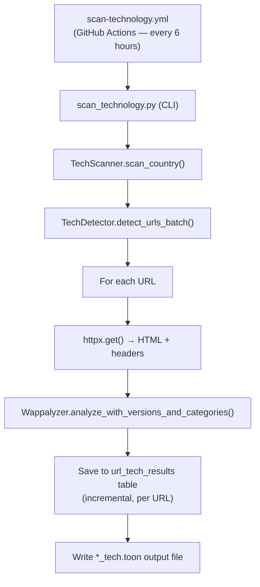

<!-- TECH_STATS_START -->

_Stats as of 2026-05-16 06:10 UTC — last scan: 2026-05-14_

**13** scan batches run

**9,386** of **7,626** available pages scanned (**123.1%** coverage)
**8,439** pages with technology detections (**89.9%** of scanned)
**304** unique technologies identified

---

## Technology Scan by Country

| Country | URLs Scanned | Pages with Detections | Available | Last Scan |
|---------|-------------|----------------------|-----------|----------|
| Usa Edu Master | 3,749 | 2,818 | 3,763 | 2026-05-13 |
| Usa Edu Master Subdomains | 9,380 | 8,405 | 3,763 | 2026-05-14 |
| Usa Edu Top100 | 100 | 89 | 100 | 2026-05-13 |

> Hover or focus any non-zero country-table count to preview matching pages. Activate the number to keep the preview open and download a CSV for that country and metric from [Download machine-readable technology data (JSON)](technology-data.json).

---

### Top Technologies

| # | Technology | Pages | Categories |
|--:|-----------|------:|-----------|
| 1 | jQuery | **4,955** | JavaScript libraries |
| 2 | Google Tag Manager | **3,447** | Tag managers |
| 3 | Font Awesome | **3,303** | Font scripts |
| 4 | PHP | **3,245** | Programming languages |
| 5 | Google Font API | **2,870** | Font scripts |
| 6 | Bootstrap | **2,406** | UI frameworks |
| 7 | Apache | **2,084** | Web servers |
| 8 | Nginx | **1,857** | Reverse proxies, Web servers |
| 9 | MySQL | **1,784** | Databases |
| 10 | WordPress | **1,778** | Blogs, CMS |
| 11 | jQuery Migrate | **1,617** | JavaScript libraries |
| 12 | Cloudflare | **1,520** | CDN |
| 13 | jsDelivr | **1,059** | CDN |
| 14 | Windows Server | **1,045** | Operating systems |
| 15 | IIS | **1,036** | Web servers |
| 16 | Microsoft ASP.NET | **800** | Web frameworks |
| 17 | Amazon Web Services | **798** | PaaS |
| 18 | Varnish | **789** | Caching |
| 19 | Slick | **757** | JavaScript libraries |
| 20 | jQuery UI | **731** | JavaScript libraries |
| 21 | Modernizr | **678** | JavaScript libraries |
| 22 | Drupal | **672** | CMS |
| 23 | Yoast SEO | **636** | SEO |
| 24 | YouTube | **541** | Video players |
| 25 | WP Engine | **452** | PaaS |
| 26 | Amazon Cloudfront | **410** | CDN |
| 27 | Lightbox | **406** | JavaScript libraries |
| 28 | animate.css | **380** | UI frameworks |
| 29 | Pantheon | **342** | PaaS |
| 30 | MariaDB | **342** | Databases |

### Top Technology Categories

| # | Category | Pages |
|--:|---------|------:|
| 1 | JavaScript libraries | **10,574** |
| 2 | Font scripts | **6,232** |
| 3 | Web servers | **5,697** |
| 4 | Programming languages | **3,708** |
| 5 | Tag managers | **3,458** |
| 6 | CDN | **3,184** |
| 7 | UI frameworks | **3,124** |
| 8 | CMS | **2,719** |
| 9 | Databases | **2,528** |
| 10 | PaaS | **2,155** |
| 11 | Reverse proxies | **1,979** |
| 12 | Blogs | **1,823** |
| 13 | Operating systems | **1,532** |
| 14 | Caching | **1,295** |
| 15 | Web frameworks | **1,036** |

📥 Machine-readable results: [Download machine-readable technology data (JSON)](technology-data.json) · [Download as CSV](technology-data.csv)

<!-- TECH_STATS_END -->

---

## Overview

The technology scanner fetches each government page and uses
[python-Wappalyzer](https://github.com/chorsley/python-Wappalyzer) to identify
technologies from HTTP response headers and HTML content.  Detected
technologies (CMS, web server, JavaScript frameworks, analytics, etc.) and
their versions are stored in the metadata database and written back into an
annotated `*_tech.toon` TOON file.

Scans run **automatically every 6 hours** via GitHub Actions so that the full
set of URLs across all seed files can be covered gradually without overloading
government servers.

---

## Usage

### Scan a single seed

```bash
python3 -m src.cli.scan_technology --country USA_EDU_MASTER --rate-limit 2
```

### Scan all seed files

```bash
python3 -m src.cli.scan_technology --all --rate-limit 2
```

### Scan all seed files with a runtime cap (recommended for CI)

```bash
python3 -m src.cli.scan_technology --all --max-runtime 110 --rate-limit 2.0
```

### Command-line options

| Option | Default | Description |
|---|---|---|
| `--country CODE` | — | Seed code to scan (e.g. `USA_EDU_MASTER`) |
| `--all` | — | Scan all seed files in the TOON directory |
| `--toon-dir PATH` | `data/toon-seeds` | Directory with `.toon` seed files |
| `--rate-limit N` | `2.0` | Maximum HTTP requests per second |
| `--max-runtime N` | `0` (no limit) | Maximum runtime in minutes.  The scanner stops gracefully before this limit so that partial results can be saved.  Set to ~10 minutes less than the GitHub Actions `timeout-minutes` value. |

---

## GitHub Actions

The **Scan Technology Stack** workflow (`.github/workflows/scan-technology.yml`)
runs automatically every 6 hours and can also be triggered manually from the
Actions tab:

1. Go to **Actions → Scan Technology Stack → Run workflow**
2. Optionally enter a seed code (leave blank to scan all seed files)
3. Optionally adjust the rate limit

Artifacts uploaded after each run:

| Artifact | Contents |
|---|---|
| `tech-scan-<run_number>` | `data/metadata.db`, scan output log, annotated `*_tech.toon` files |
| `validation-metadata` | `data/metadata.db` (shared with URL validation and social media scans) |

---

## Output

### Annotated TOON file

Each page entry in the output `*_tech.toon` file gains a `technologies` field:

```json
{
  "url": "https://example.gov/",
  "is_root_page": true,
  "technologies": {
    "Nginx": { "versions": ["1.24"], "categories": ["Web servers"] },
    "WordPress": { "versions": ["6.2"], "categories": ["CMS", "Blogs"] }
  }
}
```

If detection failed for a URL, a `tech_error` field is added instead:

```json
{
  "url": "https://unreachable.gov/",
  "tech_error": "Connection error: ..."
}
```

### Database table

Results are stored in the `url_tech_results` table:

| Column | Type | Description |
|---|---|---|
| `url` | TEXT | Page URL |
| `country_code` | TEXT | Legacy field name for seed identifier (e.g. `USA_EDU_MASTER`) |
| `scan_id` | TEXT | Unique scan run ID |
| `technologies` | TEXT | JSON object of detected technologies |
| `error_message` | TEXT | Error message (if detection failed) |
| `scanned_at` | TEXT | ISO-8601 timestamp |

Query example:

```sql
SELECT url, technologies
FROM url_tech_results
WHERE country_code = 'USA_EDU_MASTER'
ORDER BY scanned_at DESC;
```

---

## Architecture



---

## Notes

- **Rate limiting** is applied between requests to avoid overloading government
  servers.  The default is 2 requests per second.
- Technology fingerprinting is best-effort; some sites may return no detections
  if they use custom or obfuscated stacks.
- Unlike the URL validator, failed tech scans do **not** mark a URL for removal
  — errors are recorded but the URL is kept in future scan cycles.
- Results are persisted **incrementally** (one URL at a time) so that partial
  results are preserved even if the GitHub Actions job times out.
- The `*_tech.toon` output files are excluded from version control (see
  `.gitignore`).
